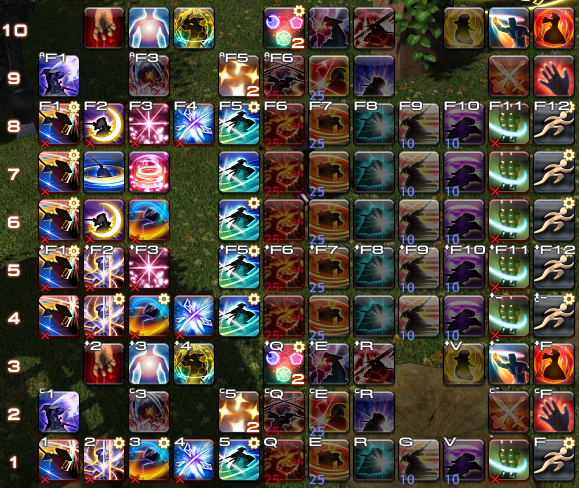

# 宏学(第四版)


## 前言  
自《宏学(第三版)》发表以来已经过去了两个大版本，虽然很长一段时间宏学研究都没有太大进展，但经历多次版本更新后，有些内容已经过时。第四版大幅更改了篇章结构和语言以提高可读性，增加了一些新的内容和说明，并将各种举例说明中已经被删除或更改的技能替换为了现版本的技能。

宏学 (Macrology) 是一门研究宏和文本指令的原理、性质及其应用的学问。

与其他MMORPG中功能强大的宏相比，FF14中的宏功能上是非常弱的，因此要在FF14中发挥出宏的价值，需要进行精细的研究和设计。Macrology一词在英语中意为繁冗，宏正是一种相当繁冗的事物，只有对宏进行繁冗的精雕细琢，才能实现一些具有较高价值、有高度创造性的功能。 

宏学博大精深，~~新理论和新技术层出不穷~~，作者水平有限，文章不足或错误之处，恳求广大读者指正。   

特别感谢艾欧泽亚宏学研讨会全体成员。    

本文除特殊标注的部分外，均为原创内容。转载不需要取得作者许可，但需附上原文链接。 

作者：  
猫小胖-摩杜纳：月咏泠音  
Mana-Ixion: Suzune Tsukuyomi  

## 阅读说明
本文是理论性文章，所有研究内容均不直接服务于实战，也不提供实战数据证明。  

本文演示所用的所有手法都不代表正确循环，仅作为宏效果示例。

本文不会给出太多的完整例子，只会举出局部例子和整体效果图，缺失之处，由读者自行思考。 

不答复任何伸手求宏的回复。  

本文最后编辑于：版本7.1

## 目录
- [绪论](#绪论)
- [第一节 文本指令与宏](#第一节-文本指令与宏)
  - [文本指令](#文本指令)
  - [代名词](#代名词)
  - [宏](#宏)
  - [宏面板](#宏面板)
- [第二节 初等宏](#第二节-初等宏)
  - [技能](#技能)
  - [等待](#等待)
  - [宏图标](#宏图标)
  - [取消宏](#取消宏)
  - [锁定宏指令](#锁定宏指令)
  - [宏错误提示](#宏错误提示)
  - [发送信息](#发送信息)
  - [示例](#示例)
- [第三节 热键栏操作](#第三节-热键栏操作)
  - [热键栏](#热键栏)
  - [更改热键栏的显示](#更改热键栏的显示)
  - [更改热键栏的内容](#更改热键栏的内容)
  - [其他热键栏](#其他热键栏)
- [第四节 翻页宏](#第四节-翻页宏)
  - [翻页宏原理](#翻页宏原理)
  - [绑定技能的翻页宏](#绑定技能的翻页宏)
  - [简单切换宏](#简单切换宏)
  - [跳转菜单宏](#跳转菜单宏)
  - [折叠菜单宏](#折叠菜单宏)
- [第五节 aswc宏](#第五节-aswc宏)
  - [aswc宏原理](#aswc宏原理)
  - [aswc式喊话宏](#aswc式喊话宏)
  - [aswc宏辅助翻页宏](#aswc宏辅助翻页宏)
  - [aswc一键连击宏](#aswc一键连击宏)
- 第六节 节约宏位和热键栏
  - 连续set
  - 滚动宏
  - 辅助热键栏共用
- 第七节 高等宏学
  - 利用宏报错实现判断
  - 栈 & 多级回退
  - 一宏多用 & 交联强化
  - 帧 & wait13f & 模拟技能队列
- 第八节 其他
  - 用宏实现伪随机
  - 流程引导宏
  - 用宏优化优先级机制
  - 翻页核心泛用搭载框架
  - 其他小技巧
  - 难以解决的问题
  - 宏学杂技
  - 宏学思想
  - 我的宏分享 & 其他推荐
  - 宏事故分析法
  - FAQ
- 后记

## 绪论
本文共分为八节：
- 第1~2节：较为基础的入门内容
- 第3~5节：难度和泛用性兼具的进阶内容
- 第6~7节：难度较高的深度内容
- 第8节：不太好分类的杂谈内容

在开始正题之前，我给各位读者一句忠告：不要使用任何你没弄清原理的宏。你没有弄清楚宏的原理，你就不知道它在什么样的情况下可能会出错，出错了该怎么解决。你对宏的认识没有得到提升，你只是装上了一个不可控的炸弹。 

## 第一节 文本指令与宏
### 文本指令
在讲宏之前，我们先要了解一项和宏息息相关的，经常和宏相混淆的概念：**文本指令**。

在FF14中，**文本指令**是一种特殊的操作方式。

玩家通过键盘或鼠标点选技能热键可以释放技能，而通过输入`/ac 技能`，玩家也可以施放技能。输入文本指令`/ac`一定程度上相当于玩家点选技能热键的操作。

因为FF14没有专用的文本指令输入区域，所有的文本指令都在对话框内输入。为了区别于对话内容，系统规定输入文本指令时，以`/`这个符号起头表示这是一句文本指令而不是对话内容。**（如果不以`/`开头，即使是多了一个空格，你的指令也会被当做一句话发送到当前频道）**

部分文本指令在主命令之外，还需要加一些具体的可变参数，这些参数被称为子命令。子命令通过空格和文本指令的其他部分分隔，从文本指令的第一个空格起开始编号。

值得一提的是，指定名称（如技能名）为子命令时，在国际服英语等语言的客户端下，部分名称中也包含空格。此时需要将该名称用双引号括起来，以将其识别为一个子命令。另外，这种名称中的大小写不敏感。

大部分文本指令都有包括中文写法在内的多种写法，笔者主要用英语写法展示，因为英语写法搭配定型文容易实现在多种语言的客户端间兼容。

由于文本指令数量众多，笔者只能挑一些很重要，很难理解的文本指令在这篇文章中说明。大部分文本指令其实都很简单，只要自己尝试一次就能明白。

文本指令的官方说明可以通过输入 `/? 查询的文本指令` 查看，也可以查阅 [灰机Wiki](https://ff14.huijiwiki.com/wiki/%E6%96%87%E6%9C%AC%E6%8C%87%E4%BB%A4) 或 [Lodestone](https://jp.finalfantasyxiv.com/lodestone/playguide/db/text_command/) 。

### 代名词
代名词是文本指令的一种特殊形式，一般形如<...>，替代用户输入一段可随当前状态改变的文本。

在文本指令中使用代名词，可以指定文本指令的一些参数和对象。如`/ac 退避 <2>`可以指定文本指令`/ac 退避`向2号队员使用。

在发送信息时使用代名词，发送时会自动将代名词替换成对应的内容。对应的内容不存在时，会显示为空字符。例如，假设2号队员叫XXX，发送`已退避<2>！`时会自动变成`已退避XXX！`，没有组队时则会变成`已退避！`。

在信息中使用代名词时，大部分代名词的替换在收到信息者的客户端进行，因此在国际服，代名词可以正确显示出对应的内容在对方客户端语言中的文本。（但是`<item>`例外，虽然道具链接会正确显示出对方客户端语言中的文本，但道具的名字在对话框中会显示为发送者客户端中的文本）

代名词在游戏内的文本指令一览中查不到，可以查阅 [灰机Wiki](https://ff14.huijiwiki.com/wiki/%E6%96%87%E6%9C%AC%E6%8C%87%E4%BB%A4#.E4.BB.A3.E5.90.8D.E8.AF.8D) 或 [Lodestone](https://jp.finalfantasyxiv.com/lodestone/playguide/db/text_command/placeholder/) 。

以下是一些值得额外解释的代名词：

| 代名词 | 解释 |
| -- | -- | 
| `<le>` | 最后选中的敌人的名字 (当前目标是敌人时，显示当前目标，否则显示上个选中的敌人) |
| `<mo>` | 当前鼠标指向的目标的名字，指向小队列表/仇恨列表/目标模型都可以（手柄的预选中状态不行） |
| `<attack>` | 所有已标记的`攻击1~5`记号中序号最小的标记目标的名字 |
| `<bind>` | 所有已标记的`止步1~3`记号中序号最小的标记目标的名字 |
| `<stop>` | 所有已标记的`禁止1~2`记号中序号最小的标记目标的名字 |
| `<pos>` | 自己的地区名和坐标（地图链接，可以被点击标记） |
| `<flag>` | 标记的地区名和坐标（地图链接，可以被点击标记）。如果没有标记，则显示为`【没有设置地图链接的目标】`。用 `Ctrl+鼠标右键` 在地图上标记时，会自动输入对话框中。 |
| `<item>` | 最近选择过`展示道具属性`的道具链接。装备上的魔晶石、签名、精炼度、耐久等不能正确显示，只能显示基本属性。如果最近没有选择过`展示道具属性`，则会替换为空字符。选择“展示道具属性”时，会自动输入对话框中。 |
| `<se.1>~<se.16>` | 特殊代名词，不会替换为其他内容。在小队/团队/默语频道中发送时，对所有收到信息的玩家播放对应的音效。可写为`<se>`，会被自动随机补全为`<se.X>`。 |
| `<wait.秒数>` | 特殊代名词，不会显示在消息中且自身之后的内容全部消失。这条消息发送后令正在运行的宏暂停指定的秒数（如果宏正处于暂停状态，会刷新暂停时间为自身所指定的）。秒数只能设置为1~60的整数，小数会被四舍五入，大于60会视为60，小于1或写为`<wait>`会视为1。 | 
| `<recast.技能名>` | 指定技能的剩余冷却时间，格式为 `分:秒`，因此不能用来作为wait的时间参数。已冷却完毕的技能会显示为 `--:--`。只有当前职业的技能可以被正确显示，并且不能用定型文（技能名中间有空格的语言不需要加引号，英文大小写不敏感）。 |

<details>
<summary>全部代名词</summary>

| 代名词 | 解释 |
| -- | -- | 
| `<t>` | 当前选中目标的名字 |
| `<tt>` | 当前选中目标的选中目标的名字 |
| `<me>` | 自己的名字 |
| `<r>` | 上一个悄悄话你的人的名字 |
| `<1>~<8>` | 小队列表中对应编号的人的名字 |
| `<f>` | 焦点目标的名字 |
| `<lt>` | 上个选中的目标的名字 |
| `<le>` | 最后选中的敌人的名字 (当你的当前目标是敌人时，会显示你的当前目标，否则显示上个选中的敌人) |
| `<la>` | 上个对自己造成伤害的敌人的名字 |
| `<c>` | 自己的陆行鸟的名字 |
| `<p>` | 自己的召唤物的名字 |
| `<attack1>~<attack5>` | 被标记了“攻击1~5”记号的目标的名字（可写为`<attack>`，表示所有已标记的攻击记号中序号最小的标记目标的名字） |
| `<bind1>~<bind3>` | 被标记了“止步1~3”记号的目标的名字（可写为`<bind>`，表示所有已标记的止步记号中序号最小的标记目标的名字） |
| `<stop1>~<stop2>` | 被标记了“禁止1~2”记号的目标的名字（可写为`<stop>`，表示所有已标记的禁止记号中序号最小的标记目标的名字） |
| `<square>` | 被标记了“方块”记号的目标的名字 |
| `<circle>` | 被标记了“圆圈”记号的目标的名字 |
| `<cross>` | 被标记了“十字”记号的目标的名字（在J端为`<plus>`） |
| `<triangle>` | 被标记了“三角”记号的目标的名字 |
| `<mo>` | 当前鼠标指向的目标的名字，指向小队列表/仇恨列表/目标模型都可以（手柄的预选中状态不行） |
| `<hp>` | 自己的当前体力值/最大体力值 |
| `<hpp>` | 自己的当前体力百分比 |
| `<mp>` | 自己的当前魔力值/最大魔力值 |
| `<mpp>` | 自己的当前魔力百分比 |
| `<job>` | 自己的当前职业(等级) |
| `<pos>` | 自己的地区名和坐标（地图链接，可以被点击标记） |
| `<se.1>~<se.16>` | 特殊代名词，不会替换为其他内容。在小队/团队/默语频道中发送时，对所有收到信息的玩家播放对应的音效。可写为`<se>`，会被自动随机补全为`<se.X>`。 |
| `<buddyhp>` | 自己召唤出的搭档（陆行鸟）体力的当前值/最大值。 | 
| `<buddyhpp>` | 自己召唤出的搭档（陆行鸟）体力百分比 | 
| `<wait.秒数>` | 特殊代名词，发送时不会显示且使得自身之后的内容全部消失，这条消息发送后令正在运行的宏暂停指定的秒数（如果宏正处于暂停状态，会刷新暂停时间为自身所指定的）。秒数只能设置为1~60的整数，小数会被四舍五入，大于60会视为60，小于1或省略秒数会视为1。 | 
| `<recast.技能名>` | 指定技能的剩余冷却时间，格式为 `分:秒`，因此不能用来作为wait的时间参数。已冷却完毕的技能会显示为 `--:--`。只有当前职业的技能可以被正确显示，并且不能用定型文（技能名中间有空格的语言不需要加引号，英文大小写不敏感）。 |
| `<targethpp>` | 当前选中目标的体力百分比 | 
| `<focushpp>` | 焦点目标的体力百分比 | 
| `<targetjob>` | 当前选中目标的职业(等级) | 
| `<focusjob>` | 焦点目标的职业(等级) | 
| `<e1>~<e5>` | 水晶冲突中的对方1-5号玩家的名字 |
| `<item>` | 最近选择过`展示道具属性`的道具链接。装备上的魔晶石、签名、精炼度、耐久等不能正确显示，只能显示基本属性。如果最近没有选择过`展示道具属性`，则会替换为空字符。选择“展示道具属性”时，会自动输入对话框中。 |
| `<flag>` | 标记的地区名和坐标（地图链接，可以被点击标记）。如果没有标记，则显示为`【没有设置地图链接的目标】`。用 `Ctrl+鼠标右键` 在地图上标记时，会自动输入对话框中。 |

</details>

### 宏
输入文本指令是非常繁琐的，我们把常用的文本指令存储在一个批处理程序里，这样我们就可以直接执行这个程序来快速输入文本指令，这个程序就是**宏**。一个宏最多可以保存15行文本指令。

宏的功能是内将其中储存的每行内容以**每行1帧**的速度依次输入聊天框发送，直到遇到**第一个空白行**结束。这个行为在客户端**本地处理**，不受网络因素影响。（如果宏中有不是`/`起头的语句，它会被作为一句话发送到当前默认聊天频道）

宏不能同时运行多个，如果在一个宏未运行完之前运行另一个宏，当前运行的宏会立刻停止运行。如果正在运行的宏有宏锁保护，那么在运行完之前，任何其他宏都无法运行。（直接从对话框输入文本指令不会打断宏的运作，也不受宏锁的控制）

宏可以运行几乎所有文本指令，还可以使用宏专用指令对宏的运行进行部分控制，但这部分指令并不包含判断和循环结构，所以无法实现绝大部分基于条件判断的编程化指令。

### 宏面板
用户编写的宏通过用户宏面板来进行管理。按ESC，选择用户宏，或者选择右下角快捷菜单的系统分类内的用户宏来打开你的用户宏面板： (你也可以在键位设置中设置一个快捷键)


这里介绍一下宏面板的主要部分及其功能：
1. 宏面板翻页按钮，第一页是该角色专用的宏，第二页是与（在本客户端上启动的）其他角色公用的宏，各有100个位置。（本角色专用的宏保存在角色配置文件夹内的MACRO.DAT文件中，而与其他角色公用的宏保存在角色配置文件夹外的MACROSYS.dat文件中）
2. 宏图标，默认为，点击可以选择一些系统提供的图标，也可以使用 `/micon` 进行指定。
3. 宏名称，鼠标悬停时会显示，手柄十字热键栏也会显示。
4. 宏名称当前字符数/字符数限制，最多20字符，一个英文字母和一个汉字都算一个字符。
5. 宏内容，每行最多180字符，一个汉字算3个字符，英文字母算一个字符。将图标拖到该框中，可将其名字自动输入宏中。
6. 宏当前行数/行数限制，最多15行。
7. 宏列表，每格可以储存一个宏，可以拖动到热键栏上，但是不能拖动到别的方格上，可以右键呼出次级菜单。
8. 当前选中的宏的编号（从0开始编号）。
9. 当前页已占用宏格子的数量。
10. 打开文本指令一览。

次级菜单说明：
- 执行：执行一次这个宏。
- 复制：复制这个宏到宏剪贴板 (不能复制到聊天框发给别人！)。
- 粘贴：复制或剪切后出现，把宏剪贴板内的宏粘贴在这个位置，覆盖这个位置上原来的宏。
- 剪切：将这个宏剪切到宏剪贴板，若热键栏上有这个宏的热键，将自动删除。
- 删除：删除这个宏，若热键栏上有这个宏的热键，将自动删除。
- 撤销：删除、剪切、恢复或粘贴后出现，取消最近一次删除、剪切、恢复或粘贴操作，若操作涉及热键栏上的宏热键被删除，热键栏上的宏热键不会恢复。
- 恢复：撤销后出现，取消上一个撤销操作，若操作涉及热键栏上的宏热键被删除，热键栏上的宏热键不会恢复。

## 第二节 初等宏
### 技能
官方对`/技能`（缩写为`/ac`）指令的说明如下：
```
/技能 技能名 代名词
/action、/ac
对指定目标使用指定技能。如果身处无法使用技能的环境，或者还没有学会指定技能，则命令无效。

在技能会使用到地面目标的情况下，为技能名后设定子命令可以指定操作模式。
代名词
  省略地面目标模式，直接向指定目标发动技能。
地面关
  省略地面目标模式，直接发动技能。
>>示例
/技能 重劈 <目标>
对当前所选择的目标执行技能“重劈”。
/技能 治疗 <2>
对小队列表中的2号队员执行技能“治疗”。
/技能 缩地 <目标>
对选择目标的位置执行技能“缩地”。
/技能 缩地 地面关
对所指的位置直接执行技能“缩地”。
```
- 省略代名词时，技能的目标与你在当前状态下正常通过热键使用技能的目标一致。
- 如果当前按下这个热键不能立刻发动技能（超出射程，技能处于冷却中，动作硬直等），这个指令无效。
- 无法指定“不可设置到热键栏”的技能，需要指定此类技能时，应指定变化为此技能的原始技能。例如`纷乱雪月花`必须写作`居合术`，`赤神圣`必须写作`赤疾风`。
- 如果指定的技能已被升级后的技能取代，会自动改为释放升级后的技能，若指定未学会的升级后的技能，会自动改为升级前技能。
- 指定对目标使用的地面技能为圆形范围时，会以目标环的圆心为技能圆心放置。如果目标环圆心超出技能圆心射程，即使技能范围可以扫到，技能仍然不会释放。这一点在目标距离较远/目标体积巨大时需要特别注意。
- 地面关可以简写为gtoff，直接对鼠标所指的位置释放地面目标技能。（注意不要写成`<gtoff>`）
- 并非所有技能都通过该命令指定，部分技能应使用 `/generalaction`、`/blueaction`、`/pvpaction`、`/companionaction` 或 `/petaction` 指定。

可以说，99%玩家的战斗宏之旅都是从这里开始的。这个简单粗暴的命令似乎有着无穷的魅力，诱惑萌新去使用。在对游戏和宏的机制不太了解的情况下，很容易想当然的写出一些一键输出宏。

但是，很快人们发现，这个指令很坑。

正常使用技能热键释放技能时，有一个特殊辅助机制：**技能队列**。当你按下一个技能热键时，如果当前状态不能释放这个技能，但是在大约0.5s以内就可以释放这个技能，那么这个技能就会加入技能队列，并在你变得可以释放这个技能的下一帧自动释放出去。因此，通过技能热键释放GCD技能，可以平滑的过渡到下一个技能，使得GCD永远处于冷却中，避免GCD转好到下一次点击技能之间的不可避免的损失。

然而，通过文本指令`/ac`释放技能，不享受这个技能队列的机制。以每0.2s点击一次的速度计算，平均每次用`/ac`释放GCD技能，都会使GCD空转0.1s，俗称“卡宏”。**连续使用单独的 `/ac` 指令释放GCD技能，会导致GCD卡顿而降低输出**。

因为这样的缺点，这个指令我们一般不会单独用于GCD技能，往往用于能力技，以及生产采集职业。这个指令最主要的好处是可以通过代名词指定目标，而不用实际选中目标。

### 等待
官方对`/等待`（`/wait`）指令的说明如下：
```
/等待 等待时间
/wait
宏专用指令。可以让宏在等待指定时间后发动。
设置等待时间的数值时，“1”大约相当于1秒，且只可以设置整数。
等待时间最多可以设置为60，超过60时按60算。
```
- wait指令被读取时，正在运行的宏会暂停规定的秒数，然后继续输入。
- 在对话框中直接输入wait指令也可以影响正在运行的宏，如果该宏正在等待，会将等待时间刷新为新的指定时间。
- 等待时间可以省略，自动默认为1s。
- 等待时间其实可以输入小数，但会被四舍五入到整数。
- 代名词`<wait.X>`与`/wait`具有相同的作用，但是`<wait.X>`可以不单独占用一行，能更充分利用15行空间。（值得一提的是，在对话框中输入文本指令时，`<wait.x>`不用空格隔开会报错，但在宏里可以不带空格正常使用。~~笔者因为这个和人打赌输了一瓶幻想药~~）

由于宏只能同时运行一个，没有宏锁的wait很容易被其他宏打断，有宏锁的wait有时会阻碍其他宏操作，所以我们一般不会使用比较长的wait，除非确定一定时间内没有别的宏需要被使用。

### 宏图标
```
/宏图标 图标名 分类名
/macroicon、/micon
用户宏专用。在热键栏上显示指定图标名的图标，在同一个用户宏命令内只能生效一次。
>>分类名
技能(action)
  …将技能名指定到图标名上，可以显示出该技能的图标及技能的复唱时间、所需魔力等情报。
青魔法技能(blueaction)
  …将技能名指定到图标名上，可以显示出该技能的图标及技能的复唱时间、所需魔力等情报。
对战技能(pvpaction)
  …将对战技能名指定到图标名上，可以显示出该技能的图标及技能的复唱时间、所需魔力等情报。
共通技能(general)
  …将共通技能名指定到图标名上，可以显示出该技能的图标及技能的复唱时间。
情感动作(emote)
  …将情感动作名指定到图标名上，可以显示出该情感动作的图标。
搭档(buddy) 搭档名
  …将搭档技能名指定到图标名上，可以显示出该技能的图标。搭档名可以省略。
召唤兽(pet)
  …将召唤兽技能名指定到图标名上，可以显示出该技能的图标。
宠物(minion)
  …将宠物名指定到图标名上，可以显示出该宠物的图标。
坐骑(mount)
  …将坐骑名指定到图标名上，可以显示出该坐骑的图标。
道具(item)
  …将道具名指定到图标名上，可以显示出该道具的图标和持有数量。
标记(marking)
  …将标记名指定到图标名上，可以显示出该标记的图标。
场景标记(waymark)
  …将场景标记名指定到图标名上，可以显示出该场景标记的图标。
套装(gearset)
  …将套装编号指定到图标名上，可以显示出该套装的图标。
职业(classjob)
  …将职业名指定到图标名上，可以显示出该职业的图标。
快捷发言(quickchat)
  …将快捷发言名指定到图标名上，可以显示出该快捷发言的图标。
※省略分类
  …会按照技能名来处理。
```
- 为了区别真正的热键和只是指定为该热键图标的宏，宏的右上角会有一个小齿轮。
- 除了使用`/micon`指定图标以外，也可以在宏面板上选择使用预置图标。
- 如果指定的技能已被升级后的技能取代，会自动变为升级后的技能的技能图标，若指定未学会的升级后的技能，会自动变为升级前技能的技能图标。如果在其他职业下，会显示为该技能的最低级图标。
- 该图标会显示该技能的可用性。如果指定的技能在特定条件下会变化为其他技能，该宏的图标在满足条件时也会相应改变。
- 可以指定“不可设置到热键栏的技能”并正确显示出他们的图标。
- 指定道具作为图标的时候，你的背包里必须有该道具才能成功，且HQ与否必须对应。
- 制造职业的名字相同而图标不同的技能会自动跟随职业变换，在非生产职业下显示为刻木匠的图标。

这个指令是用来装饰你的宏的，你总不希望你的热键栏是这样的：


值得一提的是，这个指令虽然没有实际作用，但在宏运行时需要一帧来处理，所以最好写在宏的最后。

### 取消宏
```
/取消宏
/macrocancel、/mcancel
只能在对话栏中输入。停止正在执行的宏指令。
```
- 放在宏里执行无效，但也算执行了一个空宏，所以可以打断没有被锁定的宏。
- 该指令有一个等效快捷键 `停止宏指令`。 (没有默认键位，需要自己在键位设置-系统中设置)

### 锁定宏指令
```
/锁定宏指令(/锁宏)
/macrolock、/mlock
宏指令专用，使用该命令之后，在同一个宏内的所有指令完成之前不允许执行其他宏指令。
```
- 宏锁的保护只对这行指令的下方指令起效。
- 将有宏锁的宏打断的方法是使用 `/mcancel` 或者 `停止宏指令` 快捷键。

这个指令可以防止重要的宏被打断，同时，它也会降低宏的灵活度。是否要使用它因人而异。

### 宏错误提示
```
/宏错误提示 子命令
/macroerror、/merror
宏命令专用。设置是否显示在运行宏命令的过程中出现的错误提示。宏命令运行前默认为显示状态。宏命令结束后，即使之前设置成了不显示状态，也会自动回到默认的显示状态。
>>子命令
开(on)
  显示错误提示。
关(off)
  不显示错误提示。
无子命令
  在显示与不显示之间切换。
```
- 关闭报错只对这行指令的下方指令起效。
- 只能关闭在对话框中显示的错误，不能关闭在屏幕中间弹出的错误提示。

一般只用`/merror off`，可以屏蔽一些因为复合宏逻辑而产生的对话框报错。

### 发送信息
通过文本指令，可以快速发送信息，提示他人。

为了避免刷屏，部分公共频道设置了连续发言限制，玩家每秒只能在每个有限制的频道发送一条消息。

这里陈列了一些发送/处理对话框信息的文本指令及各个频道的特征：

| 文本指令 | 对应频道及说明 |
| -- | -- |
| /s | 说话频道，可见范围比较小，对连续发言有限制。（即使受到连续发言限制，要求说话的任务也视为完成） |
| /em | 情感动作频道，和说话频道基本相同，ID和内容之间没有冒号。对连续发言有限制，但在受到限制时不会收到系统提示。 |
| /y | 呼喊频道，可见范围比说话频道大一些，对连续发言有限制。 |
| /sh | 喊话频道，该地图内全屏可见，对连续发言有限制。 |
| /tell | 悄悄话频道，格式`/tell 人物名@服务器名(同服省略) 内容`，对连续发言有限制，省略内容将改变悄悄话默认目标。 |
| /reply | 悄悄话频道，送信目标为上一个给你发悄悄话人，不会因为下线而消除。 |
| /p | 小队频道，不限制连续发言，`<se>`提示音有效。 |
| /a | 团队频道，不限制连续发言，`<se>`提示音有效。 |
| /fc | 部队频道，不限制连续发言。 |
| /pvpteam | 战队频道，~~我还没有~~ |
| /cwl`x` | 跨服通讯贝频道，`x`为通讯贝编号，省略则为最近一个激活的通讯贝——最近一个激活可以是用指令发言(未切换频道)或者主动切换默认频道(不管有没有发言)，省略内容将改变默认频道，不限制连续发言 |
| /l`x` | 通讯贝频道，`x`为通讯贝编号，省略则为最近一个激活的通讯贝——最近一个激活可以是用指令发言(未切换频道)或者主动切换默认频道(不管有没有发言)，省略内容将改变默认频道，不限制连续发言 |
| /b | 新人频道，不限制连续发言 |
| /e | 默语频道，仅自己可见，发送速度比其他频道都快得多，`<se>`提示音有效 |
| /cth | 清除悄悄话记录，清除的实际上是曾悄悄话过的对象而不是悄悄话内容 |
| /cl | 清空对话框内的所有信息 |

### 示例
以下是一些常用的初等宏。示例中的重复`/ac`可复制更多行以改善手感。
- 释放指定地面目标的能力技。因为这些技能本来就无法享受技能队列机制，这样可以省去点击地面或再次点击热键的时间。
  ```
  /ac 野战治疗阵 <t>
  /ac 野战治疗阵 <t>
  /micon 野战治疗阵
  ```
  ```
  /ac 缩地 gtoff
  /ac 缩地 gtoff
  /micon 缩地
  ```
- 在不选中目标的情况下对目标快速使用技能。
  ```
  /ac 以太步 <mo>
  /ac 以太步 <mo>
  /micon 以太步
  ```
  ```
  /ac 退避 <2>
  /ac 退避 <2>
  /micon 退避
  ```
- 按照优先级释放技能。值得一提的是，如果在等待硬直/冷却时连按，有小概率发生优先级低的技能先释放的情况。（帧数越高，事故发生率越低，按每0.2s点击一次计算，60帧约8%，144帧约3%）。
  ```
  /ac 集中加工
  /ac 加工
  /micon 加工
  ```
  ```
  /ac 扇舞·急
  /ac 扇舞·急
  /ac 扇舞·序
  /micon 扇舞·序
  ```
- 一键生产。
  ```
  /ac 工匠的神速技巧 <wait.3>
  /ac 崇敬 <wait.2>
  /ac 坯料制作 <wait.3>
  /ac 坯料制作
  ```
- 开怪前倒计时给有特殊需求的职业。
  ```
  /cd 20
  /p 还有20s开怪 <se.1><wait.5>
  /p 还有15s开怪 <se.1><wait.5>
  /p 还有10s开怪 <wait.1>
  /p 还有9s开怪 <wait.1>
  /p 还有8s开怪 <wait.1>
  /p 还有7s开怪 <wait.1>
  /p 还有6s开怪 <wait.1>
  ```
- 划水摸鱼。~~假装自己可以wait2.5~~
  ```
  /ac 神圣 <wait.3>
  /ac 神圣 <wait.3>
  /micon 神圣
  ```
- 在发动技能后喊话提示，可再加入`/wait`防止刷屏。
  ```
  /ac 死斗
  /ac 死斗
  /p 死斗已开启！<se.1>
  /micon 死斗
  ```
  ```
  /ac 退避 <2>
  /ac 退避 <2>
  /ac 退避 <2> <wait.1>
  /p 已退避 <2> ！
  /micon 退避
  ```
- 整合上坐骑和冲刺，在可以上坐骑的地方上坐骑，不能上坐骑的地方开冲刺。如果想在可以上坐骑的地方开冲刺，需要跳起来按。
  ```
  /mount 坐骑名
  /ac 冲刺
  /ac 冲刺
  /micon 冲刺
  ```

## 第三节 热键栏操作
### 热键栏
热键栏（hotbar），是摆放热键（hotkey）的栏，经常被称做技能栏。其实除了技能还有很多东西可以放在热键栏上，比如宏、道具、制作笔记、快捷指令等，它们都称为热键。

对于键鼠玩家而言，每个职业都有10条专用热键栏，包括9个基础职业，11个生产采集职业，22个战斗特职。所有职业还共享10条共通热键栏，共430条PvE用独立热键栏可自由更改。

每个职业的十条热键栏编号为1-10，共通热键栏的编号会显示方框镂空数字（），而专用热键栏是无外框数字（）。一条热键栏有12格，依次编号为1-12。

玩家同时最多能显示不同编号的热键栏各一条，并且需要决定每一条热键栏显示为本职业专用热键栏或是共通热键栏。

系统初始状态默认显示1、2号两条，默认配置1、2、3号为职业专用热键栏，其他为共通热键栏。

热键栏是进阶宏的核心操作对象，在开发过程中会大量使用隐藏的热键栏，建议记录使用的隐藏热键栏，以防未来不慎覆盖了这些热键栏而导致混乱。

文本指令`/热键栏`（`/hotbar`）可以用于操作热键栏，由于操作种类相当多样，该文本指令有很多子命令。如果他的最后若干个子命令有错误，而有错误的子命令前的命令能构成一句完整的命令，那么错误部分会被忽视。

官方的指令的说明如下：
```
/热键栏 子命令
/hotbar
对热键栏进行操作及设置。只能在非对战区域内使用。
>>子命令
设置(set)或技能(action) 技能名 编号1 编号2
  将指定技能设置到编号1热键栏的编号2位置上。编号1可以用“当前(current)”来表示当前热键栏1位置的热键栏。省略编号2会默认为设置到编号最小的空位上。两个编号都省略则会默认设置到编号最小热键栏的编号最小空位上。
青魔法技能(blueaction) 青魔法名 编号1 编号2
  将指定青魔法设置到编号1热键栏的编号2位置上。设置规则与“设置(set)”相同。
共通技能(general) 共通技能名 编号1 编号2
  将指定共通技能设置到编号1热键栏的编号2位置上。设置规则与“设置(set)”相同。
道具(item) 道具名 编号1 编号2
  将指定道具设置到编号1热键栏的编号2位置上。设置规则与“设置(set)”相同。
情感动作(emote) 情感动作名 编号1 编号2
  将指定情感动作设置到编号1热键栏的编号2位置上。设置规则与“设置(set)”相同。
搭档(buddy) 搭档技能名 编号1 编号2
  将指定搭档技能设置到编号1热键栏的编号2位置上。设置规则与“设置(set)”相同。
召唤兽(pet) 召唤兽技能名 编号1 编号2
  将指定召唤兽技能设置到编号1热键栏的编号2位置上。设置规则与“设置(set)”相同。
宠物(minion) 宠物名 编号1 编号2
  将指定宠物设置到编号1热键栏的编号2位置上。设置规则与“设置(set)”相同。
坐骑(mount) 坐骑名 编号1 编号2
  将指定坐骑设置到编号1热键栏的编号2位置上。设置规则与“设置(set)”相同。
标记(marking) 标记名 编号1 编号2
  将指定标记设置到编号1热键栏的编号2位置上。设置规则与“设置(set)”相同。
场景标记(waymark) 场景标记名 编号1 编号2
  将指定场景标记设置到编号1热键栏的编号2位置上。设置规则与“设置(set)”相同。
更换(change) 编号
  将指定编号的热键栏切换到默认热键栏1的位置。编号用“下一个(next)”或“上一个(prev)”可以将当前热键栏1位置所表示的技能切换到上一组或者下一组热键。
复制(copy) 职业名1 编号1 职业名2 编号2
  将职业名1的编号1热键栏的内容复制到职业名2的编号2热键栏上。职业名设置为“当前(current)”时会指定当前的职业。职业名设置为“共通(share)”时会指定共通热键栏。
显示(display) 编号 开(on)
  显示指定编号的热键栏。
显示(display) 编号 关(off)
  关闭显示指定编号的热键栏。
显示(display) 编号
  在显示和不显示之间切换。
共通(share) 编号 开(on)
  将指定编号的热键栏设置成全职业共通。
共通(share) 编号 关(off)
  将指定编号的热键栏从全职业共通改为当前职业专用。
共通(share) 编号
  设置指定编号的热键栏在当前职业专用和全职业共通之间切换。
清除(remove) 编号1 编号2
  解除编号1热键栏编号2位置上的技能或用户宏指令。编号2设置为“全部(all)”的时候会将该热键栏上的所有指令都解除。
```
由于这个指令的子命令过多，接下来将分类讲解。

### 更改热键栏的显示
更改热键栏显示的子命令包括 `display`、`share` 和 `change`。
#### display
```
显示(display) 编号 开(on)
  显示指定编号的热键栏。
显示(display) 编号 关(off)
  关闭显示指定编号的热键栏。
显示(display) 编号
  在显示和不显示之间切换。
```
- 隐藏与否不影响其上的内容，若被隐藏的热键栏设置有键位，仍然可以正常按键起效。
- 切换热键栏的显示与否也可以在角色设置、界面设置里进行。

#### share
```
共通(share) 编号 开(on)
  将指定编号的热键栏设置成全职业共通。
共通(share) 编号 关(off)
  将指定编号的热键栏从全职业共通改为当前职业专用。
共通(share) 编号
  设置指定编号的热键栏在当前职业专用和全职业共通之间切换。
```
- 共通热键栏和各个职业的专用热键栏都是独立的热键栏，即使将对应编号的热键栏更改了显示设置，上面已经放置的热键也不会消失，只是隐藏到无法显示的地方。
- 将同编号的共通热键栏与专用热键栏切换显示也可以在角色设置里进行。

#### change
```
更换(change) 编号
  将指定编号的热键栏切换到默认热键栏1的位置。编号用“下一个(next)”或“上一个(prev)”可以将当前热键栏1位置所表示的技能切换到上一组或者下一组热键。
```
- 切换后的热键栏虽然显示其他编号的热键栏，仍然使用1号热键栏绑定的键位。
- 切换并不是交换，可造成同时显示两条相同的热键栏。此时在其中一条热键栏上操作时，另一条热键栏上也会出现操作反馈。
- 在切换后的热键栏上修改热键，会立刻反映到对应的热键栏上。
- 切换到的热键栏会保持其是否设定为共通热键栏的性质。
- 切换时1号热键栏不可见，但上面已经放置的热键不会消失。
- 热键栏切换也可以通过点击1号热键栏编号上下的箭头进行切换。

### 更改热键栏的内容
更改热键栏内容的子命令包括 `set`、`blueaction`、`general`、`item`、`emote`、`buddy`、`pet`、`minion`、`mount`、`marking`、`waymark`、`remove` 和 `copy`。

除了`remove` 和 `copy`，其余的所有子命令都和`set`具有几乎相同的用法，我们统称为 `set系`。

#### set系
```
设置(set)或技能(action) 技能名 编号1 编号2
  将指定技能设置到编号1热键栏的编号2位置上。编号1可以用“当前(current)”来表示当前热键栏1位置的热键栏。省略编号2会默认为设置到编号最小的空位上。两个编号都省略则会默认设置到编号最小热键栏的编号最小空位上。
青魔法技能(blueaction) 青魔法名 编号1 编号2
  将指定青魔法设置到编号1热键栏的编号2位置上。设置规则与“设置(set)”相同。
共通技能(general) 共通技能名 编号1 编号2
  将指定共通技能设置到编号1热键栏的编号2位置上。设置规则与“设置(set)”相同。
道具(item) 道具名 编号1 编号2
  将指定道具设置到编号1热键栏的编号2位置上。设置规则与“设置(set)”相同。
情感动作(emote) 情感动作名 编号1 编号2
  将指定情感动作设置到编号1热键栏的编号2位置上。设置规则与“设置(set)”相同。
搭档(buddy) 搭档技能名 编号1 编号2
  将指定搭档技能设置到编号1热键栏的编号2位置上。设置规则与“设置(set)”相同。
召唤兽(pet) 召唤兽技能名 编号1 编号2
  将指定召唤兽技能设置到编号1热键栏的编号2位置上。设置规则与“设置(set)”相同。
宠物(minion) 宠物名 编号1 编号2
  将指定宠物设置到编号1热键栏的编号2位置上。设置规则与“设置(set)”相同。
坐骑(mount) 坐骑名 编号1 编号2
  将指定坐骑设置到编号1热键栏的编号2位置上。设置规则与“设置(set)”相同。
标记(marking) 标记名 编号1 编号2
  将指定标记设置到编号1热键栏的编号2位置上。设置规则与“设置(set)”相同。
场景标记(waymark) 场景标记名 编号1 编号2
  将指定场景标记设置到编号1热键栏的编号2位置上。设置规则与“设置(set)”相同。
```
- current指代的 `当前热键栏1位置的热键栏` 实际指的是 `当前热键栏1显示的热键栏` ，即 `/hotbar change` 切换的热键栏。
- 如果指定的位置已经摆放了热键，那么原有的热键会被删除。
- 指定的热键栏继承共通热键栏设定。
- 使用 `set` 时，摆放的技能热键是真正的热键，正常享受技能队列。
- 使用 `set` 时，无法指定“不可设置到热键栏”的技能，需要指定此类技能时，应指定变化为此技能的原始技能。例如`纷乱雪月花`必须写作`居合术`，`赤神圣`必须写作`赤疾风`。
- 使用 `set` 时，如果指定的技能已被升级后的技能取代，会自动改为放置升级后的技能，若指定未学会的升级后的技能，会自动改为升级前技能。
- 使用 `set` 时，指定的技能名必须是本职业的技能。（如果指定生产职业的技能，只要有一个职业学会了，其他未学会的职业都可以指定）
- 大部分 `general` 的对象都可以用 `set` 指定，为数不多的例外是 `跳跃` （因为和龙骑士的特职技能重名）。
- 使用 `item` 时，只能指定存在于背包中的道具。（如果是高品质道具，则必须粘贴上高品质符号）
- 使用 `emote`、`minion` 和 `mount`时，只能指定已经学会的情感动作/宠物/坐骑。

#### remove
```
清除(remove) 编号1 编号2
  解除编号1热键栏编号2位置上的技能或用户宏指令。编号2设置为“全部(all)”的时候会将该热键栏上的所有指令都解除。
```
- `解除` 指的是删除热键。
- 指定的热键栏继承共通热键栏设定。

#### copy
```
复制(copy) 职业名1 编号1 职业名2 编号2
  将职业名1的编号1热键栏的内容复制到职业名2的编号2热键栏上。职业名设置为“当前(current)”时会指定当前的职业。职业名设置为“共通(share)”时会指定共通热键栏。
```
- 职业名可以使用大写三字母缩写。
- 可读取和修改未显示的热键栏。即使未解锁的职业的热键栏，以及未设置的共通/专用热键栏也可以被指定。
- 可以复制源热键栏上的任何热键，**包括宏**。该命令是目前唯一能够创造宏热键的命令。
- 如果复制的源热键栏上有生产职业的技能，且将要复制到的热键栏属于另一生产职业，在复制时会将这些技能自动替换为该职业的同名技能。
- 目标栏上原有的内容将被覆盖。

### 其他热键栏
除了上文所述的热键栏 (hotbar) 以外，游戏中还存在4种其他类型的热键栏：十字热键栏 (crosshotbar)、对战热键栏 (pvphotbar) 、对战十字热键栏 (pvpcrosshotbar) 和特殊热键栏。

#### 十字热键栏
十字热键栏是主要供手柄操作使用的热键栏，但键鼠玩家一样可以在角色菜单中将其调出。

每个职业拥有8条十字热键栏，一条十字热键栏有16个格子，由3个字母按一定的规则编号：首先是L/R指代LT按下或者RT按下，然后是D/A指代十字键/ABXY，最后是是U/D/L/R分别指代上下左右，连起来的字符串就是编号。

十字热键栏通常情况下只能同时显示一条，可通过启用双十字热键栏来显示额外一条十字热键栏，并通过双击LT/RT进行操作。

增强十字热键栏指通过按不同的顺序同时按下LT/RT可翻页到一条指定的热键栏，并非一种热键栏。

十字热键栏同样可以使用文本指令 `/crosshotbar` 进行操作，其子命令几乎和 `/hotbar` 一致。

#### 对战热键栏和对战十字热键栏
对战热键栏和对战十字热键栏也是独立的热键栏，它们只能在PvP区域内使用。

只有可进行PvP对战的特职拥有对战热键栏和对战十字热键栏，数量和规则均与热键栏和十字热键栏相同。

对战热键栏和对战十字热键栏可以使用文本指令 `/pvphotbar` 和 `/pvpcrosshotbar` 进行操作，其子命令几乎和 `/hotbar` 一致。这两个指令只能在对战区域内使用。

#### 特殊热键栏
特殊热键栏是携带召唤兽、搭档陆行鸟、乘骑部分坐骑、部分任务战斗时使用的固定热键栏，大部分不可修改。

## 第四节 翻页宏
### 翻页宏原理
虽然一个职业可以同时使用10条热键栏，但实际上由于键位和界面布局的限制，在同一场景下，一般只有不到一半的热键栏能够被合理的同时使用。在这样的情况下，1号热键栏的翻页功能提供了一个绝佳的使用方式。1号热键栏通过`/hotbar change`翻页，可以使用1号热键栏上绑定的键位来操作其他热键栏上的内容，极大的提高了键位的利用率，这就是最原始的翻页宏。

然而随着这一研究的进展，10条热键栏便显得有些不够用了。`/hotbar change`进行的翻页只能局限于将1号热键栏切换为本职业或共通的其他热键栏，这些热键栏虽然一般不用于操作，但有时也充当显示功能。后来人们发现，`/hotbar copy XXX Y current 1`同样可以造成类似于`/hotbar change`的翻页效果。这种翻页方式更加灵活，不但可以使用隐藏的420条热键栏，还可以对1号以外的热键栏进行翻页，这构成了现代翻页宏系统的根基。

与翻页宏这一工具最相适应的便是状态机。角色有很多状态，一些是系统规定的状态，一些是人为规定的状态。若在某个状态下，有应该使用的热键和不应该使用的热键，就可以成为一个状态。例如，黑魔法师的星极火和灵极冰状态是系统规定的，在灵极冰状态下，炽炎、绝望、耀星等技能都被系统强制禁用，这就是一个技能状态。再例如，捕鱼人的技能明确分成了垂钓和叉鱼两组，不同的采集类型构成了两种采集状态。

我们可以通过翻页宏，根据状态把不应该使用的热键转移到隐藏的热键栏上，把应该使用的热键放到最顺手的热键栏上，高效地利用顺手的键位。这样的系统可以防止在一个状态中失误使用错误的热键，更容易按到正确的热键，并大幅度的节约键位。

由于翻页宏大量使用隐藏的热键栏来实现功能，我们根据其功能将这些热键栏和操作进行了一些简单的定义：
- 操作热键栏：玩家实际显示在界面中，一般设置有键位(或鼠标点)的热键栏。
- 储存热键栏：储存了热键配置的隐藏热键栏，主要通过 `/hotbar copy` 复制到操作热键栏来调用。
- 显示器：因为成为 `/hotbar copy` 的粘贴目标而不能储存热键的操作热键栏。因为覆盖式粘贴的原因，在显示器中改变的热键会在下次翻页的时候恢复原样。
- 转到/复位：用 `/hotbar copy` 将储存热键栏复制到操作热键栏上，使其显示对应的状态/恢复更改前的状态。

### 绑定技能的翻页宏
技能状态的改变主要来自技能释放，所以将释放某改变技能状态的技能与翻页绑定是不增加操作量的最好选择。

但是在前文中，我们也讲过，释放技能的`/ac`指令不享受技能队列，如何让这个改变技能状态的技能绑定在宏里后仍然进入技能队列，是必须要解决的问题。

只有普通的技能热键可以进入技能队列，要实现这一点，则必须设法点击普通技能热键。在翻页时，热键栏会在按下宏的瞬间切换，因此，我们可以在翻页后同一个位置放上普通技能热键，这样只要按键连打就可以自然的点击普通技能热键，从而享受技能队列。

最后我们考虑一种情况：GCD已经在空转时，这样做会导致GCD延后两次点击之间的时间。在最前端加上一行`/ac`，即可解决此问题。由于在正常情况下，GCD不会空转，该行`/ac`一般会由于GCD未转好而无法运行，不产生实际效力。在有部分特殊需要的时候，也可以不加，通过手动提前翻页来解决此问题。

技能翻页宏的整体触发流程为：

`（点一下）点击宏，运行翻页指令 ->（再点一下）点击翻页后同一位置的技能热键，使其进入技能队列`

我们直接来看一个实例。龙骑士因其有足足10个基础GCD连击技能而给键位排布造成了不小的困难，我们通过翻页宏对此问题进行了优化：


如图所示，通过翻页宏，我们将10个GCD技能压缩进了4个键位。该翻页宏在内部隐藏热键栏的排布如图：


我们始终使用1号热键栏上的键位1234来进行连击，通过`/hotbar copy`将其他热键栏上的内容复制到1号热键栏上操作。

无论当前状态，我们要开始一次新的单体连击时，总要先打精准刺，然后在贯通刺和开膛枪之中选择一个，我们将其放在一起，这就是4号热键栏上所显示的状态。为了保证任何时刻我们都可以使用精准刺重新开始连击，我们设计精准刺宏如下：

```
/ac 精准刺
/hotbar copy 龙骑士 4 龙骑士 1
/micon 精准刺
```

这个宏始终放在第一格，以保证其键位永远不变。

假设接下来我们打贯通刺，那么再下一个技能就应该是苍穹刺，而不可能再是开膛枪。我们将苍穹刺替换掉开膛枪，使其放在一起，这就是5号热键栏上所显示的状态。链接这两个状态的关键是使用贯通刺，因此我们设计贯通刺宏如下：

```
/ac 贯通刺
/hotbar copy 龙骑士 5 龙骑士 1
/micon 贯通刺
```

接下来，我们打出苍穹刺，然后再下一个技能就应该是龙牙龙爪，而不可能再打贯通刺了。我们将龙牙龙爪替换掉贯通刺，使其放在一起，这就是6号热键栏上所显示的状态。链接这两个状态的关键是使用苍穹刺，因为我们设计苍穹刺宏如下：

```
/ac 苍穹刺
/hotbar copy 龙骑士 6 龙骑士 1
/micon 苍穹刺
```

这些宏几乎完全一样，我相信剩余的不必再赘述。在这张图中，每个纵列的相同技能图标中，只有一个不带有右上角的小齿轮的真实热键，剩余的带有小齿轮的宏，则是使用`/hotbat copy`将含有对应真实热键的热键栏复制到1号热键栏上。

图中状态4是使用精准刺后、状态5是使用贯通刺后、状态6是使用苍穹刺后、状态7是使用龙牙龙爪/龙尾大回旋后、状态8是使用樱花怒放后、状态9是使用开膛枪后、状态10是AOE连击中。正常完成龙骑士单体循环10连的技能状态切换顺序是：`4 -> 9 -> 8 -> 7 -> 4 -> 5 -> 6 -> 7`，按键顺序是`13232 12323`。该状态机只有2和3键在不断变化，1和4键作为连击的起点始终保持不变，可以在任何时候从头开始单体或AOE连击。

该热键栏上的其他热键，应将其在每一个技能状态中都复制出来，保持其不变。

需要注意的是，在这样的状态机下，1号热键栏成为了一个“显示器”。每次`/hotbar copy`运行时都覆盖了1号热键栏上的内容，因此在1号热键栏上进行的任何修改，都会在下一次翻页时被清除掉。要永久更改其内容，需要在实际储存了技能状态的隐藏热键栏上更改，或者在1号热键栏上修改后使用`/hotbar copy`将其复制到对应的实际储存热键栏上保存。

这种翻页宏的修改略微有些繁琐，但对于一般的翻页宏情况，本职业隐藏的热键栏一般已经够用，可如下制作调试模式：

1. 在角色设置-热键栏设置中选择显示热键栏编号，显示未设置的格子。
1. 在界面设置中选择一个新的存档，将所有热键栏全部显示，把10条热键栏排列整齐。
1. 制作一个调试用宏，切换界面设置存档的同时关闭所有热键栏的共通设置。
1. 另外制作一个恢复用宏，切换回原来的界面设置存档的同时将共通热键栏设置调回正常状态。

这样便可以直接在宏面板中右键执行调试模式宏以进行可视化更改。

参考调试宏：
```
/e 开启调试模式
/hudlayout 3
/hotbar share 1 off
/hotbar share 2 off
/hotbar share 3 off
/hotbar share 4 off
/hotbar share 5 off
/hotbar share 6 off
/hotbar share 7 off
/hotbar share 8 off
/hotbar share 9 off
/hotbar share 10 off
```
```
/e 关闭调试模式
/hudlayout 1
/hotbar share 1 off
/hotbar share 2 off
/hotbar share 3 off
/hotbar share 4 on
/hotbar share 5 on
/hotbar share 6 on
/hotbar share 7 on
/hotbar share 8 on
/hotbar share 9 on
/hotbar share 10 on
```

<details>
<summary>一个更详细的示例</summary>

这个演示是5.X录的，所以有几个技能没升级，不过不影响其核心原理。


其中点击的宏是：

```
/ac 士风
/hotbar copy 武士 5 武士 1
/micon 士风
```

隐藏的热键栏如图：



以下是比较详细的一次翻页操作的解析：  

最初，1号热键栏上复制的是4号热键栏上的内容，刚打完刃风。


此时我按下士风宏，可以看到GCD还没转好，`/ac 士风`没有成功释放，`/hotbar copy 武士 5 武士 1`完成翻页，1号热键栏上变成了复制的5号热键栏上的内容。


这时我再按了一下，按到翻页出来的士风热键，使其进入技能队列。  


可以看到我没有再按第三下，士风成功通过技能队列释放。
  


</details>

### 简单切换宏
有一些场景下，翻页宏可仅作为分类切换使用，而不绑定技能。

例如，蝰蛇剑士拥有逻辑完全相同的单体和AOE连击技能，每种5个，给键位排布也造成了一些麻烦。我们同样可以用翻页宏来优化这一问题：


这样的翻页宏非常简单，只需要将内容放在两条热键栏上，然后用两个宏将他们复制到操作热键栏上即可。

图中的两个宏是：

```
/hotbar copy VPR 4 VPR 1
```

```
/hotbar copy VPR 5 VPR 1
```

如果有必要，你也可以将他们放到不同的位置，比如另一条热键栏上，用两个不同的键切换，以防切错。

### 跳转菜单宏
翻页宏也能实现跳转菜单功能，例如：


该翻页宏在内部隐藏热键栏的排布如图：


这个翻页宏将生产职业技能分类为作业、加工和耐久回复，通过1号热键栏的三个宏跳转到热键栏4、5、6三个子菜单上，并通过它们的最后一格的宏从10号热键栏恢复1号热键栏，即返回主菜单。返回主菜单附带了同步2号和3号热键栏的功能。

图中的四个宏是：
```
/micon 制作
/hotbar copy 裁衣匠 4 current 1
```

```
/micon 加工
/hotbar copy 裁衣匠 5 current 1
```

```
/micon 掌握
/hotbar copy 裁衣匠 6 current 1
```

```
/e 返回主菜单
/hotbar copy 裁衣匠 10 current 1
/hotbar copy 裁衣匠 2 current 2
/hotbar copy 裁衣匠 3 current 3
```

该宏系统最主要的价值是巧用current，可以在多个生产职业之中通用，免去了对每个生产职业都单独调整一遍键位的麻烦。不过同样地，只有在裁衣匠的热键栏中修改键位才有效，在其他职业下修改会被自动还原。

<details>
<summary>为什么做这个？为什么有多余的返回宏？</summary>
这个宏系统由于现在很少手动搓东西，看起来不是很有用。这其实是一个很古老的菜单宏的遗迹，它4.X的时候长这样：


5.X的时候长这样：


随着生产职业技能的逐渐减少，这个宏系统渐渐快要退出历史舞台了，不过对于讲解跳转菜单宏来说是一个很好的例子。
</details>

### 折叠菜单宏
将翻页用的宏和实际翻页的热键栏放在不同的热键栏上，再配合`/hotbar display`，可以实现一些折叠菜单效果。

例如，使用30多个职业的套装热键切换职业或一键更衣是非常占热键栏的。通过折叠菜单宏，可以对切换套装进行分类整理：


图示中最左侧的固定热键栏是9号共通热键栏，右侧出现的热键栏是8号共通热键栏。

作为所有职业都可能使用的热键，理论上将储存热键栏也设置在共通热键栏上会比较方便，不过实际上分类较多的话共通热键栏是不够用的，可以将它们寄存在一些有空闲的职业热键栏上。

例如：

```
/hotbar copy 武僧 4 share 8
/hotbar display 8 on
/wait 5
/hotbar display 8 off
```

对应的储存热键栏寄存在了闲置的4号武僧热键栏上。该宏会在5秒后自动隐藏套装热键栏。

值得一提的是，想要用这样的菜单宏兼容PVP区域内的职业切换，需要增加一些额外的兼容性文本指令：

```
/merror off
/hotbar copy 武僧 4 share 8
/pvphotbar copy 武僧 4 share 8
/hotbar display 8 on
/pvphotbar display 8 on
/wait 5
/hotbar display 8 off
/pvphotbar display 8 off
```

## 第五节 aswc宏
### aswc宏原理
上一节讲翻页宏的时候，我们已经接触到了用文本指令释放技能时避免“卡宏”，享受技能队列的方式：不直接用`/ac`释放技能，而是通过热键栏翻页点击与宏处在同一位置的真实技能热键。这一节我们将进一步从这一点展开。

除了翻页以外，我们实际上还可以使用`/hotbar set`指令直接创造热键。将设置的热键栏位置直接指定为该宏当前所在的位置，即可直接创造真实技能热键覆盖该宏，再按一次即可使技能进入技能队列。

此操作直接覆盖了宏的热键，导致宏变成了一次性热键。为解决此问题，可以事先备份含有宏的热键栏，使用`/wait`指令等待技能热键已经顺利发动之后，再用`/hotbar copy`将其还原复位。

最后同样考虑GCD已经在空转时，这样做会导致GCD延后两次点击之间的时间。在最前端加上一行`/ac`，即可解决此问题。由于在正常情况下，GCD不会空转，该行`/ac`一般会由于GCD未转好而无法运行，不产生实际效力。在有部分特殊需要的时候，也可以不加，通过手动提前触发此宏来解决此问题。

aswc宏的整体触发流程为：

`（点一下）点击宏，运行附带指令并覆盖宏放置技能热键 -> （再点一下）点击刚放置的技能热键，使其进入技能队列 -> 数秒后将被覆盖的宏还原`

这种宏的基本结构为`/ac -> /hotbar set -> /wait -> /hotbar copy`，简称aswc。并非所有aswc宏都具有这样规范的结构，其中只有`/hotbar set`是必不可少的，其他部分均具有可替代性。

这种宏的作用为在令一个技能享受技能队列的同时，将一段文本指令与其绑定。绑定的文本指令可以根据需要插入在结构中的任何地方。aswc宏可以当作是一种高级的`/ac`宏形式，虽然不能通过代名词指定未选中的目标，但可以享受技能队列。

### aswc式喊话宏
aswc宏是一种理想的喊话宏载体，既通过创造技能热键解决了一般的技能喊话宏无法进入技能队列的缺点，又通过自我消除解决了按键连打可能造成刷屏的缺点。

~~其实，aswc宏开发的最初目的就是创造“不会卡宏的喊话宏”，这样就可以每个GCD都喊话了。~~

```
/ac 强力射击
/hotbar copy 吟游诗人 1 吟游诗人 4
/hotbar set 强力射击 1 1
/e 我用aswc宏打了一个不卡宏的强力射击，你也来试试吧！
/wait 1
/hotbar copy 吟游诗人 4 吟游诗人 1
/micon 强力射击
```

本例中包含两个非aswc宏基本结构的语句：`/hotbar copy 吟游诗人 1 吟游诗人 4` 将热键栏进行了备份，这样在简单的aswc宏中就可以不必事先备份热键栏了。`/e` 可以替换为任何文本指令，实现各种想要的功能，而不仅仅局限于喊话。~~为什么是默语？你不会真的想发到队伍频道里吧~~

值得注意的是，这个宏运用了 `/wait` 指令来实现复位。如果在此期间需要插入别的宏（例如在挑衅喊话宏后立刻使用退避宏），最后的copy会被打断而无法复位。此时最简单的办法是加上宏锁阻止它被打断，但这样可能会影响必要的其他宏使用。这种情况下，可以在可能将其打断的宏上都增加一行复位的指令，或者在一个使用频率更高的GCD翻页宏上绑定一个复位。

<details>
<summary>一个更详细的示例</summary>

这个例子也是5.X录的，有几个技能没升级，不影响核心部分。


图示中点击的宏是：

```
/ac 神圣领域
/hotbar copy 骑士 3 骑士 4
/hotbar set 神圣领域 3 8
/p 神圣之光涡旋流转，天堂之门现于世间，誓约之剑君临九天！无敌！！！<se.2>
/wait 1
/hotbar copy 骑士 4 骑士 3
/micon 神圣领域
```

这是骑士3号热键栏：


我们先按下宏，此时正处于某个技能后摇中，`/ac 神圣领域` 释放技能失败，`/hotbar copy 骑士 3 骑士 4` 备份完成，`/hotbar set 神圣领域 3 8` 将神圣领域热键覆盖到宏的位置，同时 `/p` 喊话已经发送。


再次按下按键，按到新创造的神圣领域真实技能热键，将其加入技能队列。
  


`/wait 1` 之后，`/hotbar copy 骑士 4 骑士 3` 完成复位，将热键栏变回原状。


</details>

### aswc宏辅助翻页宏
aswc宏还可以作为翻页宏的辅助宏使用，令不在翻页热键栏上的部分能影响技能状态的技能也可以绑定翻页，例如：

```
/ac 明镜止水
/hotbar set 明镜止水 3 6
/hotbar copy 武士 8 武士 1
/micon 明镜止水
```
该宏的结构比较特殊，只有 `/ac` 和 `/hotbar set`，没有后面的 `/wait` 和 `/hotbar copy` 部分。`/hotbar copy 武士 8 武士 1` 是该宏中为明镜止水绑定的文本指令，将保存了明镜止水技能状态的8号热键栏复制到1号操作热键栏上。

此宏应用于武士翻页宏中，其隐藏的热键栏如下：


该宏能够省去 `/wait` 和 `/hotbar copy` 部分的原因是，翻页宏部分除了翻页的 `/hotbar copy` 指令之外，还额外附加了为aswc宏复位的 `/hotbar copy` 指令，例如：

```
/ac 刃风
/hotbar copy 武士 4 武士 1
/hotbar copy 武士 10 武士 3
/micon 刃风
```

因为打完明镜止水以后如果要重新开始连击，必定会先打刃风或风雅，所以不必在aswc宏中完成复位，只需要在翻页时顺带复位即可。因为这一设计，aswc宏避免了使用 `/wait` 指令，大幅提高了宏系统的稳定性。通过综合使用不同的宏，能够让宏互相复位而提升整体的稳定性。

### aswc一键连击宏
aswc宏的原位替换特性，使得一键连击真正成为了可能。

连击阶段是一种技能状态，它只因打出技能和连击中断而切换，所以我们可以将连击技能与切换指令绑定。

aswc宏的最后一步 `/hotbar copy` 本是为了将宏恢复原样，只要修改一下，让下一个连击状态的热键栏被复制过来即可。  

下面这个例子是在枪术师职业下录制的，所以没有龙牙龙爪的部分。


涉及的隐藏热键栏如下：


图示中出现的宏是：
```
/mlock
/ac 精准刺
/hotbar set 精准刺 1 4
/wait 1
/hotbar copy 枪术师 5 枪术师 1
/micon 精准刺
```
```
/mlock
/ac 贯通刺
/hotbar set 贯通刺 1 4
/wait 1
/hotbar copy 枪术师 6 枪术师 1
/micon 贯通刺
```
```
/mlock
/ac 直刺
/hotbar set 直刺 1 4
/wait 1
/hotbar copy 枪术师 4 枪术师 1
/micon 直刺
```

这种一键连击宏看起来很理想，但存在很多问题。

aswc一键连击宏是容错率很低的宏，必须控制按键连打的速度，防止误点、漏点、多点，在GCD还有半秒左右转好的时候高速点击2次。不要在CD转好1s前就开始激情连打，或是激情连打超过1s以上，否则可能会发生技能未成功释放就已转到下一连击的问题。一个折中解决方案是在宏的最后加上`/wait 1`(用于延长宏锁)，这可以减少你太过提前按键的机会，但仍然不能完全解决问题。此外，30秒的连击过期也会造成需要复位的局面。

因为这些原因，不推荐操作不熟练、按键喜欢激情乱按的玩家使用aswc一键连击。即使是熟练的使用者也很难完全避免这种问题的发生，只能做好万全的准备，制作一个额外的切换宏，让你能够返回被跳过的连击状态，或者在别处放一些临时应急用的普通热键。

<details>
<summary>一个更详细的示例</summary>

这是初始状态，点击精准刺宏


因为这个时候GCD正在空转，补丁`/ac 精准刺` 直接成功发动技能


1s后，`/hotbar copy 枪术师 5 枪术师 1` 生效，贯通刺宏出现在原来的位置  


点击贯通刺宏，此时GCD还没转好，`/ac 贯通刺` 发动技能失败，`/hotbar set 贯通刺 1 4` 将贯通刺热键放置在原来的位置
   


再次点击，贯通刺热键使贯通刺进入技能队列


可以看到，贯通刺成功通过技能队列释放  


1s后，`/hotbar copy 枪术师 6 枪术师 1` 生效，直刺宏出现在原来的的位置  


</details>
