# 宏学(第四版)
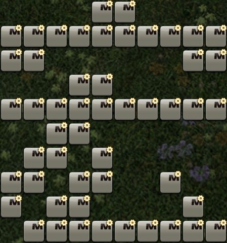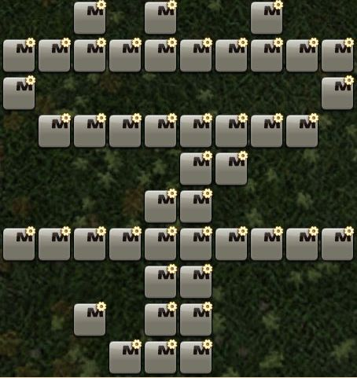

## 前言  
自《宏学(第三版)》发表以来已经过去了两个大版本，虽然很长一段时间宏学研究都没有太大进展，但经历多次版本更新后，有些内容已经过时。第四版大幅更改了篇章结构和语言以提高可读性，增加了一些新的内容和说明，并将各种举例说明中已经被删除或更改的技能替换为了现版本的技能。

宏学 (Macrology) 是一门研究宏和文本指令的原理、性质及其应用的学问。

与其他MMORPG中功能强大的宏相比，FF14中的宏功能上是非常弱的，因此要在FF14中发挥出宏的价值，需要进行精细的研究和设计。Macrology一词在英语中意为繁冗，宏正是一种相当繁冗的事物，只有对宏进行繁冗的精雕细琢，才能实现一些具有较高价值、有高度创造性的功能。 

宏学博大精深，~~新理论和新技术层出不穷~~，作者水平有限，文章不足或错误之处，恳求广大读者指正。   

特别感谢艾欧泽亚宏学研讨会全体成员。    

本文除特殊标注的部分外，均为原创内容。转载不需要取得作者许可，但需附上原文链接。 

作者：  
猫小胖-摩杜纳：月咏泠音  
Mana-Ixion: Suzune Tsukuyomi  

## 阅读说明
本文是理论性文章，所有研究内容均不直接服务于实战，也不提供实战数据证明。  

本文演示所用的所有手法都不代表正确循环，仅作为宏效果示例。

本文不会给出太多的完整例子，只会举出局部例子和整体效果图，缺失之处，由读者自行思考。 

不答复任何伸手求宏的回复。  

本文最后编辑于：版本7.1

## 目录
- [绪论](#绪论)
- [第一节 文本指令与宏](#第一节-文本指令与宏)
  - [文本指令](#文本指令)
  - [代名词](#代名词)
  - [宏](#宏)
  - [宏面板](#宏面板)
- [第二节 初等宏](#第二节-初等宏)
  - [技能](#技能)
  - [等待](#等待)
  - [宏图标](#宏图标)
  - [取消宏](#取消宏)
  - [锁定宏指令](#锁定宏指令)
  - [宏错误提示](#宏错误提示)
  - [发送信息](#发送信息)
  - [示例](#示例)
- [第三节 热键栏操作](#第三节-热键栏操作)
  - [热键栏](#热键栏)
  - [更改热键栏的显示](#更改热键栏的显示)
  - [更改热键栏的内容](#更改热键栏的内容)
  - [其他热键栏](#其他热键栏)
- [第四节 翻页宏](#第四节-翻页宏)
  - [翻页宏原理](#翻页宏原理)
  - [绑定技能的翻页宏](#绑定技能的翻页宏)
  - [简单切换宏](#简单切换宏)
  - [跳转菜单宏](#跳转菜单宏)
  - [折叠菜单宏](#折叠菜单宏)
- [第五节 aswc宏](#第五节-aswc宏)
  - [aswc宏原理](#aswc宏原理)
  - aswc式喊话宏
  - aswc一键连击宏
  
- 第六节 节约宏位和热键栏
  - 连续set
  - 滚动宏
  - 辅助热键栏共用
- 第七节 高等宏学
  - 利用宏报错实现判断
  - 栈 & 多级回退
  - 一宏多用
  - 帧 & wait13f & 模拟技能队列
- 第八节 其他
  - 用宏实现伪随机
  - 流程引导宏
  - 用宏优化优先级机制
  - 翻页核心泛用搭载框架
  - 其他小技巧
  - 难以解决的问题
  - 宏学杂技
  - 宏学思想
  - 我的宏分享 & 其他推荐
  - 宏事故分析法
  - FAQ
- 后记

## 绪论
本文共分为八节：
- 第1~2节：较为基础的入门内容
- 第3~5节：难度和泛用性兼具的进阶内容
- 第6~7节：难度较高的深度内容
- 第8节：不太好分类的杂谈内容

在开始正题之前，我给各位读者一句忠告：不要使用任何你没弄清原理的宏。你没有弄清楚宏的原理，你就不知道它在什么样的情况下可能会出错，出错了该怎么解决。你对宏的认识没有得到提升，你只是装上了一个不可控的炸弹。 

## 第一节 文本指令与宏
### 文本指令
在讲宏之前，我们先要了解一项和宏息息相关的，经常和宏相混淆的概念：**文本指令**。

在FF14中，**文本指令**是一种特殊的操作方式。

玩家通过键盘或鼠标点选技能热键可以释放技能，而通过输入`/ac 技能`，玩家也可以施放技能。输入文本指令`/ac`一定程度上相当于玩家点选技能热键的操作。

因为FF14没有专用的文本指令输入区域，所有的文本指令都在对话框内输入。为了区别于对话内容，系统规定输入文本指令时，以`/`这个符号起头表示这是一句文本指令而不是对话内容。**（如果不以`/`开头，即使是多了一个空格，你的指令也会被当做一句话发送到当前频道）**

部分文本指令在主命令之外，还需要加一些具体的可变参数，这些参数被称为子命令。子命令通过空格和文本指令的其他部分分隔，从文本指令的第一个空格起开始编号。

值得一提的是，指定名称（如技能名）为子命令时，在国际服英语等语言的客户端下，部分名称中也包含空格。此时需要将该名称用双引号括起来，以将其识别为一个子命令。另外，这种名称中的大小写不敏感。

大部分文本指令都有包括中文写法在内的多种写法，笔者主要用英语写法展示，因为英语写法搭配定型文容易实现在多种语言的客户端间兼容。

由于文本指令数量众多，笔者只能挑一些很重要，很难理解的文本指令在这篇文章中说明。大部分文本指令其实都很简单，只要自己尝试一次就能明白。

文本指令可以在游戏内通过宏面板内的文本指令一览查阅，也可以查阅 [灰机Wiki](https://ff14.huijiwiki.com/wiki/%E6%96%87%E6%9C%AC%E6%8C%87%E4%BB%A4) 或 [Lodestone](https://jp.finalfantasyxiv.com/lodestone/playguide/db/text_command/) 。

### 代名词
代名词是文本指令的一种特殊形式，一般形如<...>，替代用户输入一段可随当前状态改变的文本。

在文本指令中使用代名词，可以指定文本指令的一些参数和对象。如`/ac 退避 <2>`可以指定文本指令`/ac 退避`向2号队员使用。

在发送信息时使用代名词，发送时会自动将代名词替换成对应的内容。对应的内容不存在时，会显示为空字符。例如，假设2号队员叫XXX，发送`已退避<2>！`时会自动变成`已退避XXX！`，没有组队时则会变成`已退避！`。

在信息中使用代名词时，大部分代名词的替换在收到信息者的客户端进行，因此在国际服，代名词可以正确显示出对应的内容在对方客户端语言中的文本。（但是`<item>`例外，虽然道具链接会正确显示出对方客户端语言中的文本，但道具的名字在对话框中会显示为发送者客户端中的文本）

代名词在游戏内的文本指令一览中查不到，可以查阅 [灰机Wiki](https://ff14.huijiwiki.com/wiki/%E6%96%87%E6%9C%AC%E6%8C%87%E4%BB%A4#.E4.BB.A3.E5.90.8D.E8.AF.8D) 或 [Lodestone](https://jp.finalfantasyxiv.com/lodestone/playguide/db/text_command/placeholder/) 。

以下是一些值得额外解释的代名词：

| 代名词 | 解释 |
| -- | -- | 
| `<le>` | 最后选中的敌人的名字 (当前目标是敌人时，显示当前目标，否则显示上个选中的敌人) |
| `<mo>` | 当前鼠标指向的目标的名字，指向小队列表/仇恨列表/目标模型都可以（手柄的预选中状态不行） |
| `<attack>` | 所有已标记的`攻击1~5`记号中序号最小的标记目标的名字 |
| `<bind>` | 所有已标记的`止步1~3`记号中序号最小的标记目标的名字 |
| `<stop>` | 所有已标记的`禁止1~2`记号中序号最小的标记目标的名字 |
| `<pos>` | 自己的地区名和坐标（地图链接，可以被点击标记） |
| `<flag>` | 标记的地区名和坐标（地图链接，可以被点击标记）。如果没有标记，则显示为`【没有设置地图链接的目标】`。用 `Ctrl+鼠标右键` 在地图上标记时，会自动输入对话框中。 |
| `<item>` | 最近选择过`展示道具属性`的道具链接。装备上的魔晶石、签名、精炼度、耐久等不能正确显示，只能显示基本属性。如果最近没有选择过`展示道具属性`，则会替换为空字符。选择“展示道具属性”时，会自动输入对话框中。 |
| `<se.1>~<se.16>` | 特殊代名词，不会替换为其他内容。在小队/团队/默语频道中发送时，对所有收到信息的玩家播放对应的音效。可写为`<se>`，会被自动随机补全为`<se.X>`。 |
| `<wait.秒数>` | 特殊代名词，不会显示在消息中且自身之后的内容全部消失。这条消息发送后令正在运行的宏暂停指定的秒数（如果宏正处于暂停状态，会刷新暂停时间为自身所指定的）。秒数只能设置为1~60的整数，小数会被四舍五入，大于60会视为60，小于1或写为`<wait>`会视为1。 | 
| `<recast.技能名>` | 指定技能的剩余冷却时间，格式为 `分:秒`，因此不能用来作为wait的时间参数。已冷却完毕的技能会显示为 `--:--`。只有当前职业的技能可以被正确显示，并且不能用定型文（技能名中间有空格的语言不需要加引号，英文大小写不敏感）。 |

<details>
<summary>全部代名词</summary>

| 代名词 | 解释 |
| -- | -- | 
| `<t>` | 当前选中目标的名字 |
| `<tt>` | 当前选中目标的选中目标的名字 |
| `<me>` | 自己的名字 |
| `<r>` | 上一个悄悄话你的人的名字 |
| `<1>~<8>` | 小队列表中对应编号的人的名字 |
| `<f>` | 焦点目标的名字 |
| `<lt>` | 上个选中的目标的名字 |
| `<le>` | 最后选中的敌人的名字 (当你的当前目标是敌人时，会显示你的当前目标，否则显示上个选中的敌人) |
| `<la>` | 上个对自己造成伤害的敌人的名字 |
| `<c>` | 自己的陆行鸟的名字 |
| `<p>` | 自己的召唤物的名字 |
| `<attack1>~<attack5>` | 被标记了“攻击1~5”记号的目标的名字（可写为`<attack>`，表示所有已标记的攻击记号中序号最小的标记目标的名字） |
| `<bind1>~<bind3>` | 被标记了“止步1~3”记号的目标的名字（可写为`<bind>`，表示所有已标记的止步记号中序号最小的标记目标的名字） |
| `<stop1>~<stop2>` | 被标记了“禁止1~2”记号的目标的名字（可写为`<stop>`，表示所有已标记的禁止记号中序号最小的标记目标的名字） |
| `<square>` | 被标记了“方块”记号的目标的名字 |
| `<circle>` | 被标记了“圆圈”记号的目标的名字 |
| `<cross>` | 被标记了“十字”记号的目标的名字（在J端为`<plus>`） |
| `<triangle>` | 被标记了“三角”记号的目标的名字 |
| `<mo>` | 当前鼠标指向的目标的名字，指向小队列表/仇恨列表/目标模型都可以（手柄的预选中状态不行） |
| `<hp>` | 自己的当前体力值/最大体力值 |
| `<hpp>` | 自己的当前体力百分比 |
| `<mp>` | 自己的当前魔力值/最大魔力值 |
| `<mpp>` | 自己的当前魔力百分比 |
| `<job>` | 自己的当前职业(等级) |
| `<pos>` | 自己的地区名和坐标（地图链接，可以被点击标记） |
| `<se.1>~<se.16>` | 特殊代名词，不会替换为其他内容。在小队/团队/默语频道中发送时，对所有收到信息的玩家播放对应的音效。可写为`<se>`，会被自动随机补全为`<se.X>`。 |
| `<buddyhp>` | 自己召唤出的搭档（陆行鸟）体力的当前值/最大值。 | 
| `<buddyhpp>` | 自己召唤出的搭档（陆行鸟）体力百分比 | 
| `<wait.秒数>` | 特殊代名词，发送时不会显示且使得自身之后的内容全部消失，这条消息发送后令正在运行的宏暂停指定的秒数（如果宏正处于暂停状态，会刷新暂停时间为自身所指定的）。秒数只能设置为1~60的整数，小数会被四舍五入，大于60会视为60，小于1或省略秒数会视为1。 | 
| `<recast.技能名>` | 指定技能的剩余冷却时间，格式为 `分:秒`，因此不能用来作为wait的时间参数。已冷却完毕的技能会显示为 `--:--`。只有当前职业的技能可以被正确显示，并且不能用定型文（技能名中间有空格的语言不需要加引号，英文大小写不敏感）。 |
| `<targethpp>` | 当前选中目标的体力百分比 | 
| `<focushpp>` | 焦点目标的体力百分比 | 
| `<targetjob>` | 当前选中目标的职业(等级) | 
| `<focusjob>` | 焦点目标的职业(等级) | 
| `<e1>~<e5>` | 水晶冲突中的对方1-5号玩家的名字 |
| `<item>` | 最近选择过`展示道具属性`的道具链接。装备上的魔晶石、签名、精炼度、耐久等不能正确显示，只能显示基本属性。如果最近没有选择过`展示道具属性`，则会替换为空字符。选择“展示道具属性”时，会自动输入对话框中。 |
| `<flag>` | 标记的地区名和坐标（地图链接，可以被点击标记）。如果没有标记，则显示为`【没有设置地图链接的目标】`。用 `Ctrl+鼠标右键` 在地图上标记时，会自动输入对话框中。 |

</details>

### 宏
输入文本指令是非常繁琐的，我们把常用的文本指令存储在一个批处理程序里，这样我们就可以直接执行这个程序来快速输入文本指令，这个程序就是**宏**。一个宏最多可以保存15行文本指令。

宏的功能是内将其中储存的每行内容以**每行1帧**的速度依次输入聊天框发送，直到遇到**第一个空白行**结束。这个行为在客户端**本地处理**，不受网络因素影响。（如果宏中有不是`/`起头的语句，它会被作为一句话发送到当前默认聊天频道）

宏不能同时运行多个，如果在一个宏未运行完之前运行另一个宏，当前运行的宏会立刻停止运行。如果正在运行的宏有宏锁保护，那么在运行完之前，任何其他宏都无法运行。（直接从对话框输入文本指令不会打断宏的运作，也不受宏锁的控制）

宏可以运行几乎所有文本指令，还可以使用宏专用指令对宏的运行进行部分控制，但这部分指令并不包含判断和循环结构，所以无法实现绝大部分基于条件判断的编程化指令。

### 宏面板
用户编写的宏通过用户宏面板来进行管理。按ESC，选择用户宏，或者选择右下角快捷菜单的系统分类内的用户宏来打开你的用户宏面板： (你也可以在键位设置中设置一个快捷键)

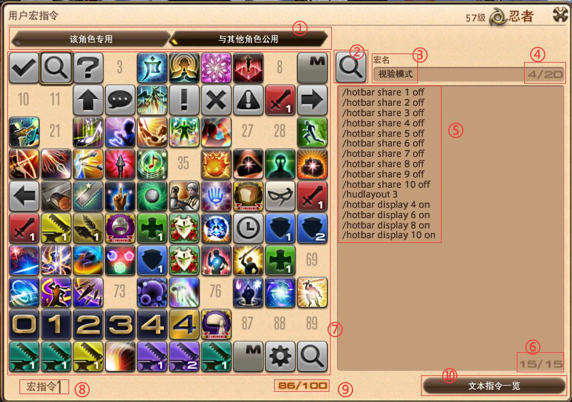

这里介绍一下宏面板的主要部分及其功能：
1. 宏面板翻页按钮，第一页是该角色专用的宏，第二页是与（在本客户端上启动的）其他角色公用的宏，各有100个位置。（本角色专用的宏保存在角色配置文件夹内的MACRO.DAT文件中，而与其他角色公用的宏保存在角色配置文件夹外的MACROSYS.dat文件中）
2. 宏图标，默认为，点击可以选择一些系统提供的图标，也可以使用 `/micon` 进行指定。
3. 宏名称，鼠标悬停时会显示，手柄十字热键栏也会显示。
4. 宏名称当前字符数/字符数限制，最多20字符，一个英文字母和一个汉字都算一个字符。
5. 宏内容，每行最多180字符，一个汉字算3个字符，英文字母算一个字符。
6. 宏当前行数/行数限制，最多15行。
7. 宏列表，每格可以储存一个宏，可以拖动到热键栏上，但是不能拖动到别的方格上，可以右键呼出次级菜单。
8. 当前选中的宏的编号（从0开始编号）。
9. 当前页已占用宏格子的数量。
10. 打开文本指令一览。

次级菜单说明：
- 执行：执行一次这个宏。
- 复制：复制这个宏到宏剪贴板 (不能复制到聊天框发给别人！)。
- 粘贴：复制或剪切后出现，把宏剪贴板内的宏粘贴在这个位置，覆盖这个位置上原来的宏。
- 剪切：将这个宏剪切到宏剪贴板，若热键栏上有这个宏的热键，将自动删除。
- 删除：删除这个宏，若热键栏上有这个宏的热键，将自动删除。
- 撤销：删除、剪切、恢复或粘贴后出现，取消最近一次删除、剪切、恢复或粘贴操作，若操作涉及热键栏上的宏热键被删除，热键栏上的宏热键不会恢复。
- 恢复：撤销后出现，取消上一个撤销操作，若操作涉及热键栏上的宏热键被删除，热键栏上的宏热键不会恢复。

## 第二节 初等宏
### 技能
官方对`/技能`（缩写为`/ac`）指令的说明如下：
```
/技能 技能名 代名词
/action、/ac
对指定目标使用指定技能。如果身处无法使用技能的环境，或者还没有学会指定技能，则命令无效。

在技能会使用到地面目标的情况下，为技能名后设定子命令可以指定操作模式。
代名词
  省略地面目标模式，直接向指定目标发动技能。
地面关
  省略地面目标模式，直接发动技能。
>>示例
/技能 重劈 <目标>
对当前所选择的目标执行技能“重劈”。
/技能 治疗 <2>
对小队列表中的2号队员执行技能“治疗”。
/技能 缩地 <目标>
对选择目标的位置执行技能“缩地”。
/技能 缩地 地面关
对所指的位置直接执行技能“缩地”。
```
- 省略代名词时，技能的目标与你在当前状态下正常通过热键使用技能的目标一致。
- 如果当前按下这个热键不能立刻发动技能（超出射程，技能处于冷却中，动作硬直等），这个指令无效。
- 无法指定“不可设置到热键栏”的技能，需要指定此类技能时，应指定变化为此技能的原始技能。例如`纷乱雪月花`必须写作`居合术`，`赤神圣`必须写作`赤疾风`。
- 如果指定的技能已被升级后的技能取代，会自动改为释放升级后的技能，若指定未学会的升级后的技能，会自动改为升级前技能。
- 指定对目标使用的地面技能为圆形范围时，会以目标环的圆心为技能圆心放置。如果目标环圆心超出技能圆心射程，即使技能范围可以扫到，技能仍然不会释放。这一点在目标距离较远/目标体积巨大时需要特别注意。
- 地面关可以简写为gtoff，直接对鼠标所指的位置释放地面目标技能。（注意不要写成`<gtoff>`）
- 并非所有技能都通过该命令指定，部分技能应使用 `/generalaction`、`/blueaction`、`/pvpaction`、`/companionaction` 或 `/petaction` 指定。

可以说，99%玩家的战斗宏之旅都是从这里开始的。这个简单粗暴的命令似乎有着无穷的魅力，诱惑萌新去使用。在对游戏和宏的机制不太了解的情况下，很容易想当然的写出一些一键输出宏。

但是，很快人们发现，这个指令很坑。

正常使用技能热键释放技能时，有一个特殊辅助机制：**技能队列**。当你按下一个技能热键时，如果当前状态不能释放这个技能，但是在大约0.5s以内就可以释放这个技能，那么这个技能就会加入技能队列，并在你变得可以释放这个技能的下一帧自动释放出去。因此，通过技能热键释放GCD技能，可以平滑的过渡到下一个技能，使得GCD永远处于冷却中，避免GCD转好到下一次点击技能之间的不可避免的损失。

然而，通过文本指令`/ac`释放技能，不享受这个技能队列的机制。以每0.2s点击一次的速度计算，平均每次用`/ac`释放GCD技能，都会使GCD空转0.1s，俗称“卡宏”。**连续使用单独的 `/ac` 指令释放GCD技能，会导致GCD卡顿而降低输出**。

因为这样的缺点，这个指令我们一般不会单独用于GCD技能，往往用于能力技，以及生产采集职业。这个指令最主要的好处是可以通过代名词指定目标，而不用实际选中目标。

### 等待
官方对`/等待`（`/wait`）指令的说明如下：
```
/等待 等待时间
/wait
宏专用指令。可以让宏在等待指定时间后发动。
设置等待时间的数值时，“1”大约相当于1秒，且只可以设置整数。
等待时间最多可以设置为60，超过60时按60算。
```
- wait指令被读取时，正在运行的宏会暂停规定的秒数，然后继续输入。
- 在对话框中直接输入wait指令也可以影响正在运行的宏，如果该宏正在等待，会将等待时间刷新为新的指定时间。
- 等待时间可以省略，自动默认为1s。
- 等待时间其实可以输入小数，但会被四舍五入到整数。
- 代名词`<wait.X>`与`/wait`具有相同的作用，但是`<wait.X>`可以不单独占用一行，能更充分利用15行空间。（值得一提的是，在对话框中输入文本指令时，`<wait.x>`不用空格隔开会报错，但在宏里可以不带空格正常使用。~~笔者因为这个和人打赌输了一瓶幻想药~~）

由于宏只能同时运行一个，没有宏锁的wait很容易被其他宏打断，有宏锁的wait有时会阻碍其他宏操作，所以我们一般不会使用比较长的wait，除非确定一定时间内没有别的宏需要被使用。

### 宏图标
```
/宏图标 图标名 分类名
/macroicon、/micon
用户宏专用。在热键栏上显示指定图标名的图标，在同一个用户宏命令内只能生效一次。
>>分类名
技能(action)
  …将技能名指定到图标名上，可以显示出该技能的图标及技能的复唱时间、所需魔力等情报。
青魔法技能(blueaction)
  …将技能名指定到图标名上，可以显示出该技能的图标及技能的复唱时间、所需魔力等情报。
对战技能(pvpaction)
  …将对战技能名指定到图标名上，可以显示出该技能的图标及技能的复唱时间、所需魔力等情报。
共通技能(general)
  …将共通技能名指定到图标名上，可以显示出该技能的图标及技能的复唱时间。
情感动作(emote)
  …将情感动作名指定到图标名上，可以显示出该情感动作的图标。
搭档(buddy) 搭档名
  …将搭档技能名指定到图标名上，可以显示出该技能的图标。搭档名可以省略。
召唤兽(pet)
  …将召唤兽技能名指定到图标名上，可以显示出该技能的图标。
宠物(minion)
  …将宠物名指定到图标名上，可以显示出该宠物的图标。
坐骑(mount)
  …将坐骑名指定到图标名上，可以显示出该坐骑的图标。
道具(item)
  …将道具名指定到图标名上，可以显示出该道具的图标和持有数量。
标记(marking)
  …将标记名指定到图标名上，可以显示出该标记的图标。
场景标记(waymark)
  …将场景标记名指定到图标名上，可以显示出该场景标记的图标。
套装(gearset)
  …将套装编号指定到图标名上，可以显示出该套装的图标。
职业(classjob)
  …将职业名指定到图标名上，可以显示出该职业的图标。
快捷发言(quickchat)
  …将快捷发言名指定到图标名上，可以显示出该快捷发言的图标。
※省略分类
  …会按照技能名来处理。
```
- 为了区别真正的热键和只是指定为该热键图标的宏，宏的右上角会有一个小齿轮。
- 除了使用`/micon`指定图标以外，也可以在宏面板上选择使用预置图标。
- 如果指定的技能已被升级后的技能取代，会自动变为升级后的技能的技能图标，若指定未学会的升级后的技能，会自动变为升级前技能的技能图标。如果在其他职业下，会显示为该技能的最低级图标。
- 这个指令可以指定衍生技能名并正确显示出他们的图标。
- 指定道具作为图标的时候，你的背包里必须有该道具才能成功，且HQ与否必须对应。
- 制造职业的名字相同而图标不同的技能会自动跟随职业变换，在非生产职业下显示为刻木匠的图标。

这个指令是用来装饰你的宏的，你总不希望你的热键栏是这样的：

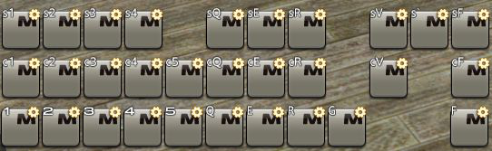

值得一提的是，这个指令虽然没有实际作用，但在宏运行时需要一帧来处理，所以最好写在宏的最后。

### 取消宏
```
/取消宏
/macrocancel、/mcancel
只能在对话栏中输入。停止正在执行的宏指令。
```
- 放在宏里执行无效，但也算执行了一个空宏，所以可以打断没有被锁定的宏。
- 该指令有一个等效快捷键 `停止宏指令`。 (没有默认键位，需要自己在键位设置-系统中设置)

### 锁定宏指令
```
/锁定宏指令(/锁宏)
/macrolock、/mlock
宏指令专用，使用该命令之后，在同一个宏内的所有指令完成之前不允许执行其他宏指令。
```
- 宏锁的保护只对这行指令的下方指令起效。
- 将有宏锁的宏打断的方法是使用 `/mcancel` 或者 `停止宏指令` 快捷键。

这个指令可以防止重要的宏被打断，同时，它也会降低宏的灵活度。是否要使用它因人而异。

### 宏错误提示
```
/宏错误提示 子命令
/macroerror、/merror
宏命令专用。设置是否显示在运行宏命令的过程中出现的错误提示。宏命令运行前默认为显示状态。宏命令结束后，即使之前设置成了不显示状态，也会自动回到默认的显示状态。
>>子命令
开(on)
  显示错误提示。
关(off)
  不显示错误提示。
无子命令
  在显示与不显示之间切换。
```
- 关闭报错只对这行指令的下方指令起效。
- 只能关闭在对话框中显示的错误，不能关闭在屏幕中间弹出的错误提示。

一般只用`/merror off`，可以屏蔽一些因为复合宏逻辑而产生的对话框报错。

### 发送信息
通过文本指令，可以快速发送信息，提示他人。

为了避免刷屏，部分公共频道设置了连续发言限制，玩家每秒只能在每个有限制的频道发送一条消息。

这里陈列了一些发送/处理对话框信息的文本指令及各个频道的特征：

| 文本指令 | 对应频道及说明 |
| -- | -- |
| /s | 说话频道，可见范围比较小，对连续发言有限制。（即使受到连续发言限制，要求说话的任务也视为完成） |
| /em | 情感动作频道，和说话频道基本相同，ID和内容之间没有冒号。对连续发言有限制，但在受到限制时不会收到系统提示。 |
| /y | 呼喊频道，可见范围比说话频道大一些，对连续发言有限制。 |
| /sh | 喊话频道，该地图内全屏可见，对连续发言有限制。 |
| /tell | 悄悄话频道，格式`/tell 人物名@服务器名(同服省略) 内容`，对连续发言有限制，省略内容将改变悄悄话默认目标。 |
| /reply | 悄悄话频道，送信目标为上一个给你发悄悄话人，不会因为下线而消除。 |
| /p | 小队频道，不限制连续发言，`<se>`提示音有效。 |
| /a | 团队频道，不限制连续发言，`<se>`提示音有效。 |
| /fc | 部队频道，不限制连续发言。 |
| /pvpteam | 战队频道，~~我还没有~~ |
| /cwl`x` | 跨服通讯贝频道，`x`为通讯贝编号，省略则为最近一个激活的通讯贝——最近一个激活可以是用指令发言(未切换频道)或者主动切换默认频道(不管有没有发言)，省略内容将改变默认频道，不限制连续发言 |
| /l`x` | 通讯贝频道，`x`为通讯贝编号，省略则为最近一个激活的通讯贝——最近一个激活可以是用指令发言(未切换频道)或者主动切换默认频道(不管有没有发言)，省略内容将改变默认频道，不限制连续发言 |
| /b | 新人频道，不限制连续发言 |
| /e | 默语频道，仅自己可见，发送速度比其他频道都快得多，`<se>`提示音有效 |
| /cth | 清除悄悄话记录，清除的实际上是曾悄悄话过的对象而不是悄悄话内容 |
| /cl | 清空对话框内的所有信息 |

### 示例
以下是一些常用的初等宏。示例中的重复`/ac`可复制更多行以改善手感。
- 释放指定地面目标的能力技。因为这些技能本来就无法享受技能队列机制，这样可以省去点击地面或再次点击热键的时间。
  ```
  /ac 野战治疗阵 <t>
  /ac 野战治疗阵 <t>
  /micon 野战治疗阵
  ```
  ```
  /ac 缩地 gtoff
  /ac 缩地 gtoff
  /micon 缩地
  ```
- 在不选中目标的情况下对目标快速使用技能。
  ```
  /ac 以太步 <mo>
  /ac 以太步 <mo>
  /micon 以太步
  ```
  ```
  /ac 退避 <2>
  /ac 退避 <2>
  /micon 退避
  ```
- 按照优先级释放技能。值得一提的是，如果在等待硬直/冷却时连按，有小概率发生优先级低的技能先释放的情况。（帧数越高，事故发生率越低，按每0.2s点击一次计算，60帧约8%，144帧约3%）。
  ```
  /ac 集中加工
  /ac 加工
  /micon 加工
  ```
  ```
  /ac 扇舞·急
  /ac 扇舞·急
  /ac 扇舞·序
  /micon 扇舞·序
  ```
- 一键生产。
  ```
  /ac 工匠的神速技巧 <wait.3>
  /ac 崇敬 <wait.2>
  /ac 坯料制作 <wait.3>
  /ac 坯料制作
  ```
- 开怪前倒计时给有特殊需求的职业。
  ```
  /cd 20
  /p 还有20s开怪 <se.1><wait.5>
  /p 还有15s开怪 <se.1><wait.5>
  /p 还有10s开怪 <wait.1>
  /p 还有9s开怪 <wait.1>
  /p 还有8s开怪 <wait.1>
  /p 还有7s开怪 <wait.1>
  /p 还有6s开怪 <wait.1>
  ```
- 划水摸鱼。~~假装自己可以wait2.5~~
  ```
  /ac 神圣 <wait.3>
  /ac 神圣 <wait.3>
  /micon 神圣
  ```
- 在发动技能后喊话提示，可再加入`/wait`防止刷屏。
  ```
  /ac 死斗
  /ac 死斗
  /p 死斗已开启！<se.1>
  /micon 死斗
  ```
  ```
  /ac 退避 <2>
  /ac 退避 <2>
  /ac 退避 <2> <wait.1>
  /p 已退避 <2> ！
  /micon 退避
  ```

## 第三节 热键栏操作
### 热键栏
热键栏（hotbar），是摆放热键（hotkey）的栏，经常被称做技能栏。其实除了技能还有很多东西可以放在热键栏上，比如宏、道具、制作笔记、快捷指令等，它们都称为热键。

对于键鼠玩家而言，每个职业都有10条专用热键栏，包括9个基础职业，11个生产采集职业，22个战斗特职。所有职业还共享10条共通热键栏，共430条PvE用独立热键栏可自由更改。

每个职业的十条热键栏编号为1-10，共通热键栏的编号会显示方框镂空数字（），而专用热键栏是无外框数字（）。一条热键栏有12格，依次编号为1-12。

玩家同时最多能显示不同编号的热键栏各一条，并且需要决定每一条热键栏显示为本职业专用热键栏或是共通热键栏。

系统初始状态默认显示1、2号两条，默认配置1、2、3号为职业专用热键栏，其他为共通热键栏。

热键栏是进阶宏的核心操作对象，在开发过程中会大量使用隐藏的热键栏，建议记录使用的隐藏热键栏，以防未来不慎覆盖了这些热键栏而导致混乱。

文本指令`/热键栏`（`/hotbar`）可以用于操作热键栏，由于操作种类相当多样，该文本指令有很多子命令。如果他的最后若干个子命令有错误，而有错误的子命令前的命令能构成一句完整的命令，那么错误部分会被忽视。

官方的指令的说明如下：
```
/热键栏 子命令
/hotbar
对热键栏进行操作及设置。只能在非对战区域内使用。
>>子命令
设置(set)或技能(action) 技能名 编号1 编号2
  将指定技能设置到编号1热键栏的编号2位置上。编号1可以用“当前(current)”来表示当前热键栏1位置的热键栏。省略编号2会默认为设置到编号最小的空位上。两个编号都省略则会默认设置到编号最小热键栏的编号最小空位上。
青魔法技能(blueaction) 青魔法名 编号1 编号2
  将指定青魔法设置到编号1热键栏的编号2位置上。设置规则与“设置(set)”相同。
共通技能(general) 共通技能名 编号1 编号2
  将指定共通技能设置到编号1热键栏的编号2位置上。设置规则与“设置(set)”相同。
道具(item) 道具名 编号1 编号2
  将指定道具设置到编号1热键栏的编号2位置上。设置规则与“设置(set)”相同。
情感动作(emote) 情感动作名 编号1 编号2
  将指定情感动作设置到编号1热键栏的编号2位置上。设置规则与“设置(set)”相同。
搭档(buddy) 搭档技能名 编号1 编号2
  将指定搭档技能设置到编号1热键栏的编号2位置上。设置规则与“设置(set)”相同。
召唤兽(pet) 召唤兽技能名 编号1 编号2
  将指定召唤兽技能设置到编号1热键栏的编号2位置上。设置规则与“设置(set)”相同。
宠物(minion) 宠物名 编号1 编号2
  将指定宠物设置到编号1热键栏的编号2位置上。设置规则与“设置(set)”相同。
坐骑(mount) 坐骑名 编号1 编号2
  将指定坐骑设置到编号1热键栏的编号2位置上。设置规则与“设置(set)”相同。
标记(marking) 标记名 编号1 编号2
  将指定标记设置到编号1热键栏的编号2位置上。设置规则与“设置(set)”相同。
场景标记(waymark) 场景标记名 编号1 编号2
  将指定场景标记设置到编号1热键栏的编号2位置上。设置规则与“设置(set)”相同。
更换(change) 编号
  将指定编号的热键栏切换到默认热键栏1的位置。编号用“下一个(next)”或“上一个(prev)”可以将当前热键栏1位置所表示的技能切换到上一组或者下一组热键。
复制(copy) 职业名1 编号1 职业名2 编号2
  将职业名1的编号1热键栏的内容复制到职业名2的编号2热键栏上。职业名设置为“当前(current)”时会指定当前的职业。职业名设置为“共通(share)”时会指定共通热键栏。
显示(display) 编号 开(on)
  显示指定编号的热键栏。
显示(display) 编号 关(off)
  关闭显示指定编号的热键栏。
显示(display) 编号
  在显示和不显示之间切换。
共通(share) 编号 开(on)
  将指定编号的热键栏设置成全职业共通。
共通(share) 编号 关(off)
  将指定编号的热键栏从全职业共通改为当前职业专用。
共通(share) 编号
  设置指定编号的热键栏在当前职业专用和全职业共通之间切换。
清除(remove) 编号1 编号2
  解除编号1热键栏编号2位置上的技能或用户宏指令。编号2设置为“全部(all)”的时候会将该热键栏上的所有指令都解除。
```
由于这个指令的子命令过多，接下来将分类讲解。

### 更改热键栏的显示
更改热键栏显示的子命令包括 `display`、`share` 和 `change`。
#### display
```
显示(display) 编号 开(on)
  显示指定编号的热键栏。
显示(display) 编号 关(off)
  关闭显示指定编号的热键栏。
显示(display) 编号
  在显示和不显示之间切换。
```
- 隐藏与否不影响其上的内容，若被隐藏的热键栏设置有键位，仍然可以正常按键起效。
- 切换热键栏的显示与否也可以在角色设置、界面设置里进行。

#### share
```
共通(share) 编号 开(on)
  将指定编号的热键栏设置成全职业共通。
共通(share) 编号 关(off)
  将指定编号的热键栏从全职业共通改为当前职业专用。
共通(share) 编号
  设置指定编号的热键栏在当前职业专用和全职业共通之间切换。
```
- 共通热键栏和各个职业的专用热键栏都是独立的热键栏，即使将对应编号的热键栏更改了显示设置，上面已经放置的热键也不会消失，只是隐藏到无法显示的地方。
- 将同编号的共通热键栏与专用热键栏切换显示也可以在角色设置里进行。

#### change
```
更换(change) 编号
  将指定编号的热键栏切换到默认热键栏1的位置。编号用“下一个(next)”或“上一个(prev)”可以将当前热键栏1位置所表示的技能切换到上一组或者下一组热键。
```
- 切换后的热键栏虽然显示其他编号的热键栏，仍然使用1号热键栏绑定的键位。
- 切换并不是交换，可造成同时显示两条相同的热键栏。此时在其中一条热键栏上操作时，另一条热键栏上也会出现操作反馈。
- 在切换后的热键栏上修改热键，会立刻反映到对应的热键栏上。
- 切换到的热键栏会保持其是否设定为共通热键栏的性质。
- 切换时1号热键栏不可见，但上面已经放置的热键不会消失。
- 热键栏切换也可以通过点击1号热键栏编号上下的箭头进行切换。

### 更改热键栏的内容
更改热键栏内容的子命令包括 `set`、`blueaction`、`general`、`item`、`emote`、`buddy`、`pet`、`minion`、`mount`、`marking`、`waymark`、`remove` 和 `copy`。

除了`remove` 和 `copy`，其余的所有子命令都和`set`具有几乎相同的用法，我们统称为 `set系`。

#### set系
```
设置(set)或技能(action) 技能名 编号1 编号2
  将指定技能设置到编号1热键栏的编号2位置上。编号1可以用“当前(current)”来表示当前热键栏1位置的热键栏。省略编号2会默认为设置到编号最小的空位上。两个编号都省略则会默认设置到编号最小热键栏的编号最小空位上。
青魔法技能(blueaction) 青魔法名 编号1 编号2
  将指定青魔法设置到编号1热键栏的编号2位置上。设置规则与“设置(set)”相同。
共通技能(general) 共通技能名 编号1 编号2
  将指定共通技能设置到编号1热键栏的编号2位置上。设置规则与“设置(set)”相同。
道具(item) 道具名 编号1 编号2
  将指定道具设置到编号1热键栏的编号2位置上。设置规则与“设置(set)”相同。
情感动作(emote) 情感动作名 编号1 编号2
  将指定情感动作设置到编号1热键栏的编号2位置上。设置规则与“设置(set)”相同。
搭档(buddy) 搭档技能名 编号1 编号2
  将指定搭档技能设置到编号1热键栏的编号2位置上。设置规则与“设置(set)”相同。
召唤兽(pet) 召唤兽技能名 编号1 编号2
  将指定召唤兽技能设置到编号1热键栏的编号2位置上。设置规则与“设置(set)”相同。
宠物(minion) 宠物名 编号1 编号2
  将指定宠物设置到编号1热键栏的编号2位置上。设置规则与“设置(set)”相同。
坐骑(mount) 坐骑名 编号1 编号2
  将指定坐骑设置到编号1热键栏的编号2位置上。设置规则与“设置(set)”相同。
标记(marking) 标记名 编号1 编号2
  将指定标记设置到编号1热键栏的编号2位置上。设置规则与“设置(set)”相同。
场景标记(waymark) 场景标记名 编号1 编号2
  将指定场景标记设置到编号1热键栏的编号2位置上。设置规则与“设置(set)”相同。
```
- current指代的 `当前热键栏1位置的热键栏` 实际指的是 `当前热键栏1显示的热键栏` ，即 `/hotbar change` 切换的热键栏。
- 如果指定的位置已经摆放了热键，那么原有的热键会被删除。
- 指定的热键栏继承共通热键栏设定。
- 使用 `set` 时，摆放的技能热键是真正的热键，正常享受技能队列。
- 使用 `set` 时，无法指定“不可设置到热键栏”的技能，需要指定此类技能时，应指定变化为此技能的原始技能。例如`纷乱雪月花`必须写作`居合术`，`赤神圣`必须写作`赤疾风`。
- 使用 `set` 时，如果指定的技能已被升级后的技能取代，会自动改为放置升级后的技能，若指定未学会的升级后的技能，会自动改为升级前技能。
- 使用 `set` 时，指定的技能名必须是本职业的技能。（如果指定生产职业的技能，只要有一个职业学会了，其他未学会的职业都可以指定）
- 大部分 `general` 的对象都可以用 `set` 指定，为数不多的例外是 `跳跃` （因为和龙骑士的特职技能重名）。
- 使用 `item` 时，只能指定存在于背包中的道具。（如果是高品质道具，则必须粘贴上高品质符号）
- 使用 `emote`、`minion` 和 `mount`时，只能指定已经学会的情感动作/宠物/坐骑。

#### remove
```
清除(remove) 编号1 编号2
  解除编号1热键栏编号2位置上的技能或用户宏指令。编号2设置为“全部(all)”的时候会将该热键栏上的所有指令都解除。
```
- `解除` 指的是删除热键。
- 指定的热键栏继承共通热键栏设定。

#### copy
```
复制(copy) 职业名1 编号1 职业名2 编号2
  将职业名1的编号1热键栏的内容复制到职业名2的编号2热键栏上。职业名设置为“当前(current)”时会指定当前的职业。职业名设置为“共通(share)”时会指定共通热键栏。
```
- 职业名可以使用大写三字母缩写。
- 可读取和修改未显示的热键栏。即使未解锁的职业的热键栏，以及未设置的共通/专用热键栏也可以被指定。
- 可以复制源热键栏上的任何热键，**包括宏**。该命令是目前唯一能够创造宏热键的命令。
- 如果复制的源热键栏上有生产职业的技能，且将要复制到的热键栏属于另一生产职业，在复制时会将这些技能自动替换为该职业的同名技能。
- 目标栏上原有的内容将被覆盖。

### 其他热键栏
除了上文所述的热键栏 (hotbar) 以外，游戏中还存在4种其他类型的热键栏：十字热键栏 (crosshotbar)、对战热键栏 (pvphotbar) 、对战十字热键栏 (pvpcrosshotbar) 和特殊热键栏。

#### 十字热键栏
十字热键栏是主要供手柄操作使用的热键栏，但键鼠玩家一样可以在角色菜单中将其调出。

每个职业拥有8条十字热键栏，一条十字热键栏有16个格子，由3个字母按一定的规则编号：首先是L/R指代LT按下或者RT按下，然后是D/A指代十字键/ABXY，最后是是U/D/L/R分别指代上下左右，连起来的字符串就是编号。

十字热键栏通常情况下只能同时显示一条，可通过启用双十字热键栏来显示额外一条十字热键栏，并通过双击LT/RT进行操作。

增强十字热键栏指通过按不同的顺序同时按下LT/RT可翻页到一条指定的热键栏，并非一种热键栏。

十字热键栏同样可以使用文本指令 `/crosshotbar` 进行操作，其子命令几乎和 `/hotbar` 一致。

#### 对战热键栏和对战十字热键栏
对战热键栏和对战十字热键栏也是独立的热键栏，它们只能在PvP区域内使用。

只有可进行PvP对战的特职拥有对战热键栏和对战十字热键栏，数量和规则均与热键栏和十字热键栏相同。

对战热键栏和对战十字热键栏可以使用文本指令 `/pvphotbar` 和 `/pvpcrosshotbar` 进行操作，其子命令几乎和 `/hotbar` 一致。这两个指令只能在对战区域内使用。

#### 特殊热键栏
特殊热键栏是携带召唤兽、搭档陆行鸟、乘骑部分坐骑、部分任务战斗时使用的固定热键栏，大部分不可修改。

## 第四节 翻页宏
### 翻页宏原理
虽然一个职业可以同时使用10条热键栏，但实际上由于键位和界面布局的限制，在同一场景下，一般只有不到一半的热键栏能够被合理的同时使用。在这样的情况下，1号热键栏的翻页功能提供了一个绝佳的使用方式。1号热键栏通过`/hotbar change`翻页，可以使用1号热键栏上绑定的键位来操作其他热键栏上的内容，极大的提高了键位的利用率，这就是最原始的翻页宏。

然而随着这一研究的进展，10条热键栏便显得有些不够用了。`/hotbar change`进行的翻页只能局限于将1号热键栏切换为本职业或共通的其他热键栏，这些热键栏虽然一般不用于操作，但有时也充当显示功能。后来人们发现，`/hotbar copy XXX Y current 1`同样可以造成类似于`/hotbar change`的翻页效果。这种翻页方式更加灵活，不但可以使用隐藏的420条热键栏，还可以对1号以外的热键栏进行翻页，这构成了现代翻页宏系统的根基。

与翻页宏这一工具最相适应的便是状态机。角色有很多状态，一些是系统规定的状态，一些是人为规定的状态。若在某个状态下，有应该使用的热键和不应该使用的热键，就可以成为一个状态。例如，黑魔法师的星极火和灵极冰状态是系统规定的，在灵极冰状态下，炽炎、绝望、耀星等技能都被系统强制禁用，这就是一个技能状态。再例如，捕鱼人的技能明确分成了垂钓和叉鱼两组，不同的采集类型构成了两种采集状态。

我们可以通过翻页宏，根据状态把不应该使用的热键转移到隐藏的热键栏上，把应该使用的热键放到最顺手的热键栏上，高效地利用顺手的键位。这样的系统可以防止在一个状态中失误使用错误的热键，更容易按到正确的热键，并大幅度的节约键位。

### 绑定技能的翻页宏
技能状态的改变主要来自技能释放，所以将释放某改变技能状态的技能与翻页绑定是不增加操作量的最好选择。

但是在前文中，我们也讲过，释放技能的`/ac`指令不享受技能队列，如何让这个改变技能状态的技能绑定在宏里后仍然进入技能队列，是必须要解决的问题。

只有普通的技能热键可以进入技能队列，要实现这一点，则必须设法点击普通技能热键。在翻页时，热键栏会在按下宏的瞬间切换，因此，我们可以在翻页后同一个位置放上普通技能热键，这样只要按键连打就可以自然的点击普通技能热键，从而享受技能队列，就像这样：

`（点一下）按下宏，造成翻页 ->（再点一下）按到翻出来的技能热键，进入技能队列`

最后我们考虑一种情况：GCD已经在空转时，这样做会导致GCD延后两次点击之间的时间。在最前端加上一行`/ac`，即可解决此问题。由于在正常情况下，GCD不会空转，该行`/ac`一般会由于GCD未转好而无法运行，不产生实际效力。在有部分特殊需要的时候，也可以不加，通过手动提前翻页来解决此问题。

我们直接来看一个实例。龙骑士因其有足足10个基础GCD连击技能而给键位排布造成了不小的困难，我们通过翻页宏对此问题进行了优化：


如图所示，通过翻页宏，我们将10个GCD技能压缩进了4个键位。该翻页宏在内部隐藏热键栏的排布如图：

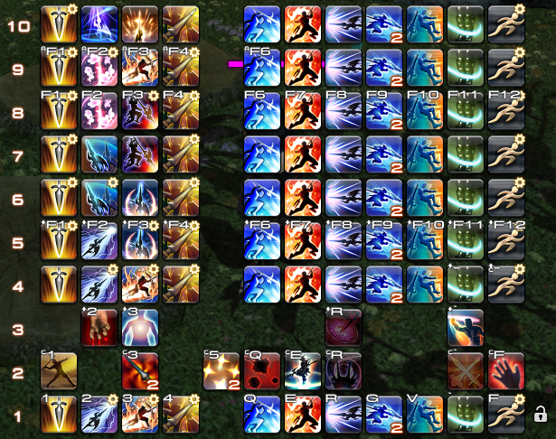

我们始终使用1号热键栏上的键位1234来进行连击，通过`/hotbar copy`将其他热键栏上的内容复制到1号热键栏上操作。

无论当前状态，我们要开始一次新的单体连击时，总要先打精准刺，然后在贯通刺和开膛枪之中选择一个，我们将其放在一起，这就是4号热键栏上所显示的状态。为了保证任何时刻我们都可以使用精准刺重新开始连击，我们设计精准刺宏如下：

```
/ac 精准刺
/hotbar copy 龙骑士 4 龙骑士 1
/micon 精准刺
```

这个宏始终放在第一格，以保证其键位永远不变。

假设接下来我们打贯通刺，那么再下一个技能就应该是苍穹刺，而不可能再是开膛枪。我们将苍穹刺替换掉开膛枪，使其放在一起，这就是5号热键栏上所显示的状态。链接这两个状态的关键是使用贯通刺，因此我们设计贯通刺宏如下：

```
/ac 贯通刺
/hotbar copy 龙骑士 5 龙骑士 1
/micon 贯通刺
```

接下来，我们打出苍穹刺，然后再下一个技能就应该是龙牙龙爪，而不可能再打贯通刺了。我们将龙牙龙爪替换掉贯通刺，使其放在一起，这就是6号热键栏上所显示的状态。链接这两个状态的关键是使用苍穹刺，因为我们设计苍穹刺宏如下：

```
/ac 苍穹刺
/hotbar copy 龙骑士 6 龙骑士 1
/micon 苍穹刺
```

这些宏几乎完全一样，我相信剩余的不必再赘述。在这张图中，每个纵列的相同技能图标中，只有一个不带有右上角的小齿轮的真实热键，剩余的带有小齿轮的宏，则是使用`/hotbat copy`将含有对应真实热键的热键栏复制到1号热键栏上。

图中状态4是使用精准刺后、状态5是使用贯通刺后、状态6是使用苍穹刺后、状态7是使用龙牙龙爪/龙尾大回旋后、状态8是使用樱花怒放后、状态9是使用开膛枪后、状态10是AOE连击中。正常完成龙骑士单体循环10连的技能状态切换顺序是：`4 -> 9 -> 8 -> 7 -> 4 -> 5 -> 6 -> 7`，按键顺序是`13232 12323`。该状态机只有2和3键在不断变化，1和4键作为连击的起点始终保持不变，可以在任何时候从头开始单体或AOE连击。

该热键栏上的其他热键，应将其在每一个技能状态中都复制出来，保持其不变。

需要注意的是，在这样的状态机下，1号热键栏成为了一个“显示器”。每次`/hotbar copy`运行时都覆盖了1号热键栏上的内容，因此在1号热键栏上进行的任何修改，都会在下一次翻页时被清除掉。要永久更改其内容，需要在实际储存了技能状态的隐藏热键栏上更改，或者在1号热键栏上修改后使用`/hotbar copy`将其复制到对应的实际储存热键栏上保存。

这种翻页宏的修改略微有些繁琐，但对于一般的翻页宏情况，本职业隐藏的热键栏一般已经够用，可如下制作调试模式：

1. 在角色设置-热键栏设置中选择显示热键栏编号，显示未设置的格子。
1. 在界面设置中选择一个新的存档，将所有热键栏全部显示，把10条热键栏排列整齐。
1. 制作一个调试用宏，切换界面设置存档的同时关闭所有热键栏的共通设置。
1. 另外制作一个恢复用宏，切换回原来的界面设置存档的同时将共通热键栏设置调回正常状态。

这样便可以直接在宏面板中右键执行调试模式宏以进行可视化更改。

参考调试宏：
```
/e 开启调试模式
/hudlayout 3
/hotbar share 1 off
/hotbar share 2 off
/hotbar share 3 off
/hotbar share 4 off
/hotbar share 5 off
/hotbar share 6 off
/hotbar share 7 off
/hotbar share 8 off
/hotbar share 9 off
/hotbar share 10 off
```
```
/e 关闭调试模式
/hudlayout 1
/hotbar share 1 off
/hotbar share 2 off
/hotbar share 3 off
/hotbar share 4 on
/hotbar share 5 on
/hotbar share 6 on
/hotbar share 7 on
/hotbar share 8 on
/hotbar share 9 on
/hotbar share 10 on
```

<details>
<summary>一个更详细的示例</summary>

这个演示是5.X录的，不过不影响其核心部分。


其中点击的宏是：

```
/ac 士风
/hotbar copy 武士 6 武士 1
/micon 士风
```

隐藏的热键栏如图：

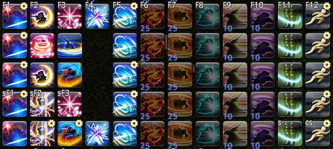

(图中的热键栏从下往上是武士的5-9号热键栏)

以下是比较详细的一次翻页操作的解析：  

最初，1号热键栏上复制的是5号热键栏上的内容。


此时我按下士风宏，可以看到GCD还没转好，`/ac 士风`没有成功释放,`/hotbar copy 武士 6 武士 1`完成翻页，1号热键栏上变成了复制的6号热键栏上的内容。


这时我再按了一下，按到翻页出来的士风热键，使其进入技能队列。  


可以看到我没有再按第三下，士风成功通过技能队列释放。
  


</details>

### 简单切换宏
有一些场景下，翻页宏可仅作为分类切换使用，而不绑定技能。

例如，蝰蛇剑士拥有逻辑完全相同的单体和AOE连击技能，每种5个，给键位排布也造成了一些麻烦。我们同样可以用翻页宏来优化这一问题：


这样的翻页宏非常简单，只需要将内容放在两条热键栏上，然后用两个宏将他们复制到操作热键栏上即可。

图中的两个宏是：

```
/hotbar copy VPR 4 VPR 1
```

```
/hotbar copy VPR 5 VPR 1
```

如果有必要，你也可以将他们放到不同的位置，比如另一条热键栏上，用两个不同的键切换，以防切错。

### 跳转菜单宏
翻页宏也能实现跳转菜单功能，例如：


该翻页宏在内部隐藏热键栏的排布如图：

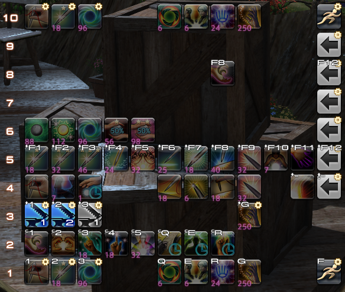

这个翻页宏将生产职业技能分类为作业、加工和耐久回复，通过1号热键栏的三个宏跳转到热键栏4、5、6三个子菜单上，并通过它们的最后一格的宏从10号热键栏恢复1号热键栏，即返回主菜单。返回主菜单附带了同步2号和3号热键栏的功能。

图中的四个宏是：
```
/micon 制作
/hotbar copy 裁衣匠 4 current 1
```

```
/micon 加工
/hotbar copy 裁衣匠 5 current 1
```

```
/micon 掌握
/hotbar copy 裁衣匠 6 current 1
```

```
/e 返回主菜单
/hotbar copy 裁衣匠 10 current 1
/hotbar copy 裁衣匠 2 current 2
/hotbar copy 裁衣匠 3 current 3
```

该宏系统最主要的价值是巧用current，可以在多个生产职业之中通用，免去了对每个生产职业都单独调整一遍键位的麻烦。不过同样地，只有在裁衣匠的热键栏中修改键位才有效，在其他职业下修改会被自动还原。

这个宏系统由于现在很少手动搓东西，看起来不是很有用。这其实是一个很古老的菜单宏的遗迹，它4.X的时候长这样：

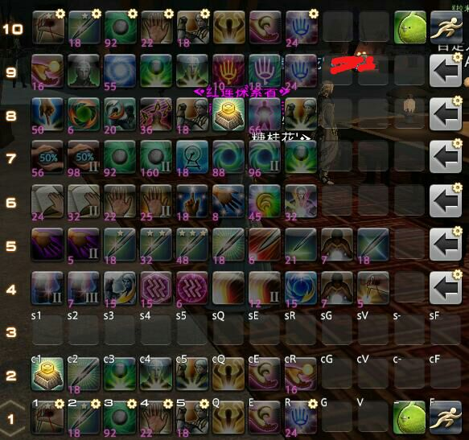

5.X的时候长这样：

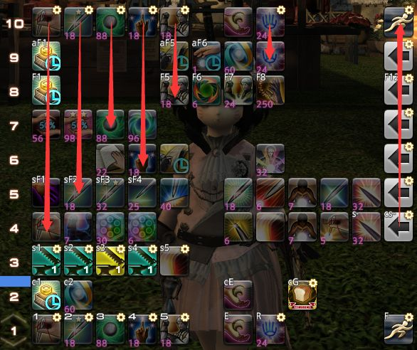

随着生产职业技能的逐渐减少，这个宏系统渐渐快要退出历史舞台了，不过对于讲解跳转菜单宏来说是一个很好的例子。

### 折叠菜单宏
将翻页用的宏和实际翻页的热键栏放在不同的热键栏上，再配合`/hotbar display`，可以实现一些折叠菜单效果。

例如，使用30多个职业的套装热键切换职业或一键更衣是非常占热键栏的。通过折叠菜单宏，可以对切换套装进行分类整理：

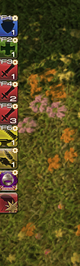

图示中最左侧的固定热键栏是9号共通热键栏，右侧出现的热键栏是8号共通热键栏。

作为所有职业都可能使用的热键，理论上将储存热键栏也设置在共通热键栏上会比较方便，不过实际上分类较多的话共通热键栏是不够用的，可以将它们寄存在一些有空闲的职业热键栏上。

例如：

```
/hotbar copy 武僧 4 share 8
/hotbar display 8 on
/wait 5
/hotbar display 8 off
```

对应的储存热键栏寄存在了闲置的4号武僧热键栏上。该宏会在5秒后自动隐藏套装热键栏。

值得一提的是，想要用这样的菜单宏兼容PVP区域内的职业切换，需要增加一些额外的兼容性文本指令：

```
/merror off
/hotbar copy 武僧 4 share 8
/pvphotbar copy 武僧 4 share 8
/hotbar display 8 on
/pvphotbar display 8 on
/wait 5
/hotbar display 8 off
/pvphotbar display 8 off
```

## 第五节 aswc宏
### aswc宏原理
上一节讲翻页宏的时候，我们已经接触到了用文本指令释放技能时避免“卡宏”，享受技能队列的方式：不直接用`/ac`释放技能，而是通过热键栏翻页点击与宏处在同一位置的真实技能热键。这一节我们将进一步从这一点展开。

除了翻页以外，我们实际上还可以使用`/hotbar set`指令直接创造热键。将设置的热键栏位置直接指定为该宏当前所在的位置，即可直接创造真实技能热键覆盖该宏，再按一次即可使技能进入技能队列。

此操作直接覆盖了宏的热键，导致宏变成了一次性热键。为解决此问题，可以事先备份含有宏的热键栏，使用`/wait`指令等待技能热键已经顺利发动之后，再用`/hotbar copy`将其还原复位。

最后同样考虑GCD已经在空转时，这样做会导致GCD延后两次点击之间的时间。在最前端加上一行`/ac`，即可解决此问题。由于在正常情况下，GCD不会空转，该行`/ac`一般会由于GCD未转好而无法运行，不产生实际效力。在有部分特殊需要的时候，也可以不加，通过手动提前触发此宏来解决此问题。

这种宏的基本结构为`/ac -> /hotbar set -> /wait -> /hotbar copy`，简称aswc。例如：

```
/ac 强力射击
/hotbar set 强力射击 1 1
/e 我用aswc宏打了一个不卡宏的强力射击，你也来试试吧！
/wait 1
/hotbar copy 吟游诗人 4 吟游诗人 1
/micon 强力射击
```

本例中的`/e`可以替换为任何文本指令，该宏的作用为在不会导致“卡宏”的前提下，将一段文本指令和一个技能释放绑定。aswc宏可以当作是一种高级的`/ac`宏形式，虽然不能通过代名词指定未选中的目标，但不会导致GCD延迟而损失输出。这种宏的形式具有非常丰富的用途。

# 以下是第三版抄过来的还没改的

## 中篇前言
从这里开始，你就进入了宏进阶领域。接下来的叙述中我会对之前提过的东西以很简略的形式描述。一些专有名词，我会在第一次出现的时候用破折号或者括号解释，此后再出现时不再解释，如果遇到了不认识的名词，建议回头再读一下前面。建议在对上篇内容有充分的学习认识后再阅读中篇。

在这里，我要说的是，进阶宏的本质是排键位，如果说无宏的键位是人跑来跑去找键位，那进阶宏就是一个智能传送带把你最需要的热键送到手边——当然也有可能送来你不需要的，毕竟宏不够智能。

宏学的操作体系是比较独立，与不用宏的操作体系差别较大，可能会对读者的常识造成一定冲击，很多被认为不可能的事情在宏学中不断发生。当然，适合自己的才是最好的，你也有可能更适合无宏的操作体系，这篇文章只是给有需求的人的一个介绍，增加一种选择，并不是说谁好谁不好。

我除了讲解该怎么做以外，会更多的讲解我们是怎么想到这样做的，这才是对一个宏研者最有意义的事情。抄作业学不到太多，宏学是创造力的表现，最好的宏也只能自己创造，自己使用。

我们介绍的思路是先从无宏到有宏，再升级优化宏，现在宏的升级方向是减少宏位消耗，毕竟200个宏位太少了。虽然这样做会增加热键栏消耗，但是390条热键栏还是比较充足的。

世界上没有绝对完美的宏，我会客观分析这些宏系统的优缺点，以及相应的缺点弥补方案。修正一个缺点往往会造成新的缺点。宏的完美，是基于使用者的完美，每个人的操作习惯不同，完美的定义就不同。没有对于每个人都完美的宏，但是，对于个人来说，专用的完美宏是一定存在的。

## 大型FAQ

- Q：有没有XX职业的宏/有没有作业抄  
A： 没有。 首先，宏是为了解决具体的问题而存在的(但宏学不是)，在问宏之前先明确自己要解决什么问题，否则只会事倍功半，得不偿失。至于有宏吗，肯定有，但是你抄不了，进阶宏非常个性化，只有理解了才能用好。进阶宏一大特点是不能直接复制，需要根据自己的操作习惯和热键排布来调整。所以我在这篇文章中主要讲述思路，只略举一些例子，若不加思考的抄袭，只会给自己带来麻烦。这些举例的宏也并不完美，使用者在自己的理解基础上可以进一步扩大功能，真正完美的宏其实是存在的，但是是不可被复制的，只有属于自己的宏才能发挥100%的威力。
- Q：手柄是不是与宏学无缘了？  
A：本文以/hotbar指令来展示各种宏只是因为作者是键鼠玩家，手柄玩家同样可以使用/chotbar指令用相似的思路制作宏系统。宏学只是一种做宏的思想，真正应用还要看使用者自己。手柄拥有自己独特的优势，但也拥有独有的困难，需要多多思考才能解决问题。
- Q：太长了，看不懂，设置好麻烦  
A：宏学的英文Macrology原义为繁冗的语句，不是我们要把简单的事情变复杂，宏本来就很复杂，之前觉得简单是因为研究不够深入。如果这个东西不麻烦就不需要写那么长的文章了，简单的宏达不到目的，不适合使用，又要简单又要好用是不可能的。看不懂的话，实际操作一下是最好的学习方法。实际上熟练后看一眼宏就可以知道大致用途，十几分钟就能做一套宏系统。
- Q：为什么好多人都说宏掉输出，还会卡宏？  
A：因为它们用的是没有雕琢过的原始宏。这些原始宏大多具有不能进入技能队列的缺点，导致了卡宏，掉输出。这些人基本没有看过现代宏学技术的成果，根据自己瞎写写的体验和道听途说得出了宏很辣鸡的结论，没有经过自己的思考，它们的言论是没有说服力的。你只需要反问他：宏为什么掉输出？宏为什么会卡宏？你有没有想过怎么让宏不卡宏？你听说过不会卡的宏吗？
- Q：(用宏/GCD技能用宏/用ac宏)会(卡宏/掉输出)  
A：只有用/ac指令最终释放技能才一定会卡宏。进阶宏系统经常在开头打个ac补丁针对GCD已经在空转的情况，这个ac正常情况下都会被卡掉，因此不会卡宏。另外卡宏不一定掉输出。如能力技ac宏会卡宏，但是一般不会影响GCD，如果一场战斗中因为卡宏损失的时间不足以让该能力多释放一次，便不掉输出。GCD技能同理，卡宏卡的GCD时间不足以在战斗中多打一个GCD，就不掉输出。一些进阶的手法可以大幅缩小ac宏GCD损失，使得不频繁使用的ac宏GCD技能加入战斗成为可能。
- Q：到底什么叫卡宏？  
A：这个词在大众中定义很广泛，概括起来就是一句话：宏做的和我想的不一样。在宏学中说的狭义的卡宏一般是指因为技能没有进入技能队列导致的技能衔接不流畅或没能使出技能。
- Q：宏最大的问题在于网络延迟  
A：所有的宏都是本地运行的，只有涉及wait的宏才受网络延迟影响发生一些意外，只要合理规避，就能正常处理。如果是稳定的延迟，可以调整wait的时间来抵消影响。至于不稳定的延迟(心电图)，这一把你已经快凉了，宏出不出问题都是小事，赶紧想办法~~害死队友重来~~止损。
- Q：那么多宏占那么多热键栏不摆别的东西吗  
A：宏学正在不断优化宏技术，减少宏位消耗，至于热键栏，我不认为390条热键栏会比200个宏位先用完。如果你觉得宏系统影响了你的其他界面布置，那很有可能是你写得有问题，没有充分利用隐藏的热键栏。
- Q：用宏简化操作怎么感觉变得更复杂了  
A：做宏的过程比较复杂，但是做好了用起来就很简化，一个地方简化了肯定有另一个地方要变复杂。宏的复杂主要是语句有些多，但是逻辑其实很简单，就是把几个热键栏复制来复制去，只要理清了各个语句的作用，就十分简单了。画个逻辑图也是很好的方法。
- Q：宏不能处理变化的情况  
A：FF14的战斗随机性比较低，所有的情况都可以穷举，不能处理说明你的宏还没有考虑到足够多的情况需要，还有需要改进的地方。多增加一些应急的方案总是有好处的。
- Q：错误操作可能导致宏系统崩溃  
A：首先，有一点无法否认的是，无论用宏还是不用，失误和错误操作都会带来惩罚，这是不变的。而对于惩罚的弥补，宏需要针对性的处理，建设以复位为核心的失误处理机制，虽然这需要一定的练习。有人认为用宏的失误几率是循环失误率+宏操作失误率，但宏其实减少了循环犯错几率。视操作者水平，循环失误率+宏操作失误率可能小于无宏状态的循环失误率。
- Q：花这么多精力研究宏还不如研究输出细节/打木桩  
A：打木桩是为了熟悉循环，写宏必须建立在高度理解循环和输出细节上，才能写出好宏。在付出这些精力写宏的同时，也会加深对输出细节/循环的认识。没有对循环的理解和对细节的把握就写宏，会出现各种问题。两者相辅相成，并不冲突。再者，宏的本质其实是键位排布，排了键位一样要打木桩练习。花费更多的时间写宏无非就是排了一个更合理的键位，自己打得更舒服。一个更合理的键位，也能有效降低木桩练习到熟练需要的时间。写宏只是再次优化一下键位和界面，并不影响你的输出循环。
- Q：为了做宏而做宏是不好的/这个宏没用/这么简单的职业还需要宏？  
A：每个宏都是为了解决问题，你觉得这个宏没用说明你不认为这是个问题，但是不代表其他玩家不认为这是个问题。比如从近战起手的玩家认为打连击是基本中的基本，但远程起家新转职的近战就经常会不小心连续把一个技能打两下。
- Q：不用宏我已经打得很好了，是不是宏学对我没啥用  
A：研究宏学也许可以让你更轻松的打得一样好，或者让你打得更好。宏是一种思想，它可以应用在方方面面，不仅仅是为了简化操作，还可以用来做各种规划。宏可以精细到每一个副本，精细处理到每一个细节，这都值得我们探索。就算是刷榜队伍成员也不一定能百分之百保证每一次战斗输出都是绝对的正确。如果我们可以用宏让输出循环更简单，那是不是就有更多精力去处理机制，去减少失误，甚至去多脏到几个GCD的输出呢？举个例子，赤魔作为开荒万金油不仅仅因为复活，也因为操作相比之下更简单，在开荒这种高压、紧急情况频出、注意力不停摇摆的时候，因为操作简单，更容易打出更接近上限的输出。即使是熟练的主职业，只要肯想肯试，也一定能找到可以用宏优化的地方。宏学发展到今天，最大的困难其实是改变自己去适应新技术，这和人类发展的规律其实是很相似的，因为写出一个完整合理的宏系统需要充分的理解，在形成这种理解的同时已经形成了一种操作习惯，而宏又会改变这种习惯。人们总是希望停留在安逸的环境中。宏研是一种对可能性的探索，每个人都有丰富的可能性，每个人也有属于自己的宏，甚至宏可以精细到每一个副本，精细处理到每一个细节，这都是可以去探索的事物，这和配装、调整循环、对齐爆发等一样有趣，也一样有价值。
- Q：宏学是面向副职、新手还是面向主职、老手？  
A：这个问题其实宏研内部没有统一的答案。随风一跃认为宏系统需要拥有深刻的职业理解才能写好用好，因为他是一名刷榜选手，他要求他的宏要能打到logs100才行。迷子认为宏是简化操作的工具，适合用来提高不追求极限的副职游玩和摸鱼体验，可以接受一部分有损的宏，因为他是一名经常开小号甚至会多开打本的咸鱼玩家。蜡笔桶认为宏学是探索宏能做到什么，能想到的东西都可以用宏做出来当玩具，无所谓有没有用，因为他是一名喜欢数据挖掘和机制探索的工匠。而我的想法是，宏学面向有志者，只要你喜欢宏，有志于宏，无论是新手上路还是熟练工都可以研究宏学，创造自己需要的宏。
- Q：为什么要研究宏学，有什么意义？  
A：首先，这是爱好。用户宏是游戏提供的玩法之一，它很有意思，研究宏是一种对可能性的探索，是一种对游戏机制的挑战，这让我们十分快乐。宏可以精细到每一个副本，精细处理到每一个细节，这都是可以去探索的事物，这和配装，调整循环，对齐爆发等一样有趣，也一样有价值。正是因为很多人认为用宏战斗“不可能”，我们才有这样的动力研究下去。其次，宏可以优化很多游戏操作和界面，让人更轻松方便的游戏，并降低游戏难度，提高游戏体验。具体有多大意义是根据每个人的观看角度和悟性不同而不同的。通过思想的碰撞，也许能获得新的灵感，获得对某事物的更多理解，这也是宏研创立的初衷。

## 宏进阶黑话集
为了更容易描述比较复杂的概念，缩减描述篇幅，我们在这里定义一些黑话：
- 操作热键栏：玩家实际显示在界面中，一般设置有键位(或鼠标点)的热键栏。
- 辅助热键栏：不直接显示在界面中，但被其他宏指令调用其中内容的热键栏。包括储存热键栏和中转热键栏。
- 储存热键栏：在进阶宏中，由于操作热键栏频繁变化，我们将热键配置储存在隐藏的热键栏上，通过copy到操作热键栏来调用，使得改变操作热键栏的操作都会在部分操作后还原。
- 中转热键栏：在更高级的宏中，为了节省宏位，实现高级功能，不直接将储存热键栏copy到操作热键栏，而将其先copy到中转热键栏，再从中转热键栏copy到操作热键栏。
- 显示器：一般是操作热键栏，特指本身不储存热键，通过不断的被复制到来显示储存在不同热键栏上的热键。在显示器中改变热键，不会改变对应的储存热键栏上的热键，下次复制的时候又会恢复原样。

**以上热键栏称呼都是基于在宏系统中的功能命名的，本质都是普通的热键栏，没有区别。**
- set系：指/hotbar (set/emote/pet/minion...)等多种和/hotbar set功能差不多的子命令。
- 转到：将某栏复制到显示器上的操作。
- 预设热键栏：在使用宏系统前将热键放置到辅助热键栏中的操作。
- 复位：将储存热键栏复制到操作热键栏使其恢复原状的操作。
- 反存：将操作热键栏复制到辅助热键栏中的操作。

## aswc式喊话宏
在上篇中，我们已经提过了防止喊话宏刷屏的方法：`/ac` `wait1` 喊话。这种方法最大的缺点是不能进入技能队列，并且喊话延后，不能起到及时提示的作用。如何解决这个问题呢？

首先我们先分析为什么传统的宏会刷屏。传统的宏，因为`/ac`不进入技能队列，必须要连打保证其释放成功。但是考虑到操作习惯，就算进入技能队列，许多玩家也喜欢激情连打。

所以我们要解决2个问题：让技能进入技能队列，并且激情连打也不会刷屏。
只有通过正常热键释放的技能能进入技能队列，所以只有用/hotbar set创造一个热键将宏取代，才能让技能进入队列。

因此，核心思路就是用/hotbar set指令创造一个热键把宏覆盖掉。这样连续按热键2次，第一次触发宏，发生喊话同时创造出热键覆盖宏，防止宏刷屏。第二次按到刚刚创造的热键，使得技能进入队列。**注意：必须按2次键才能使技能进入队列！**

很好，两个问题都解决了，但是有个新问题出现了：宏在以上操作后已经被覆盖了，这是个一次性的宏。我们需要想个办法在事后把宏放回原位，而唯一可以生成宏的指令是`/hotbar copy`。  

我们在执行上面的过程前，可以先用`/hotbar copy`把宏所在的热键栏复制到别处保存，完事以后再复制回来。为了保证复制回来之前技能已进入技能队列并成功释放，我们需要视操作习惯等待1-2s。  

整个过程是双击宏：(第一下)反存热键栏-技能热键覆盖宏-喊话-(第二下)按到刚覆盖上来的技能热键-进入技能队列-1s经过-宏返回原位。

最后，考虑当前没有硬直，本身就可以释放技能的时候，为了避免双击键间的时间损失，在最前端加上一行`/ac`，在有特殊需要的时候也可以不加。这个是最后加的，但是在宏的最前面，很多杠精看到开头一个/ac就开始杠，实际上删除这行ac也没有什么问题。

那么整个宏的构架完成了。这种宏我们简称aswc，即ac-set-wait-copy的缩写。以后我们还会在其他地方见到这种形式的宏。

我以放置在骑士第三栏第8格的无敌宏为例：(假设骑士4是空热键栏，括号内的是注解)
```
/micon 神圣领域
/ac 神圣领域 (补丁，可以删除)
/hotbar copy 骑士 3 骑士 4 (反存)
/hotbar set 神圣领域 3 8 (放下热键)
/p 神圣之光涡旋流转，天堂之门现于世间，誓约之剑君临九天！无敌！！！<se.2>
/wait 1
/hotbar copy 骑士 4 骑士 3 (复位)
```
1. 这样看起来有一点抽象，我们来看一下图例：  

2. 我们先按下宏，此时还在技能后摇中，`/ac 神圣领域`释放技能失败，`/hotbar copy 骑士 3 骑士 4 `备份完成，
`/hotbar set 神圣领域 3 8 神圣领域`热键出现在刚才的键位上，同时喊话已经发送  

3. 接下来不用我说怎么办了吧，直接摁技能就行啦  

4. 技能发动，`/wait 1`
`/hotbar copy 骑士 4 骑士 3 `复位启动，热键栏返回原状。  


最后连贯起来看一遍：


接下来讨论更多可能的问题。

- 这个宏有wait指令。如果在wait期间需要插入别的宏：例如挑衅宏后立刻使用退避宏，最后的copy会被打断而无法复位。此时最简单的办法是在可能将其打断的宏上都增加一行将其复位的指令，或者在一个使用频率更高的GCD翻页宏上绑定一个复位。  
当然你觉得wait1太长了，跟不上你对观察热键栏的需要，也可以不用wait，换成一些没有意义的指令拖延时间用高手速完成操作。
- 这个宏的技能是由普通热键释放的，因此不能指定逻辑目标。一定要指定逻辑目标的话有一个折中的方法：在宏的最前加上/ta <逻辑目标>，末尾加上/tle，这会使你的目标从敌人身上移开1s而可能丢失AA。你也可以把/tle改成手动用tab切回来减少AA损失。

## 状态机
角色有很多状态，一些是系统规定的状态，一些是人为规定的状态。若在某个状态下，有应该使用的技能和不应该使用的技能，就可以成为一个技能状态。

例如，黑魔的星极火和灵极冰状态是系统规定的，在星极火状态下，冰澈被系统强制禁用，冰结、冰冻虽然可以用，但绝对不该用，这就是一个技能状态。

再例如，武士打出阵风后，绝对不该打雪风、士风、花车，这是人为规定的状态，也是一个技能状态。

为了防止在一个技能状态中失误使用错误的技能，并节约键位，更容易按到正确的技能，我们可以通过某种方法，把不应该打出的技能从热键栏上消去，把应该打出的技能放到最顺手的键位上，高效的利用顺手的键位，这样的体系称为状态机。

接下来的几个宏思路都与状态机原理有关。

## 翻页宏
所谓翻页宏，早期是利用`/hotbar change`指令进行翻页，各技能状态分别保存在一条热键栏上。  
多条热键栏通过翻页轮流利用1号热键栏上的顺手键位，可以让技能顺手、节省键位和防止误触。

实现这样一个状态机需要解决一个问题：如何判定技能状态的改变而翻页？

技能状态的改变除了连击中断以外，都来自技能释放，所以将释放某改变技能状态的技能与翻页绑定是不增加操作量的最好选择。随之而来的问题是，如何让这个改变技能状态的技能绑定在宏里后仍然进入技能队列？  

思路仍然相同，要设法点击普通技能热键。在aswc宏中，我们依靠用set覆盖宏来实现这一热键创造。但是翻页宏中，热键栏在按下宏的瞬间切换，因此，我们并不需要set，只需要在翻页后同一个位置放上普通技能热键就可以了。

整个过程就是双击宏2次：（第一下）按下宏-翻页-（第二下）按到翻出来的技能热键-进入技能队列。
同样，考虑当前没有硬直，本身就可以释放技能的时候，为了避免双击键间的时间损失，在最前端加上一行/ac。在有特殊需要的时候同样可以不加。

整个宏非常简单，以第一栏第2格士风为例：(武士6是阵风后的技能状态所用的热键栏)
```
/micon 士风
/ac 士风(补丁，可删去)
/hotbar change 6
```
就这么点。这个宏指令很简单，复杂的是你的构建逻辑。你要想清楚这个技能状态应该干什么，不应该干什么，发生意外时可能要干什么，怎样排布键位最合理，并预设好热键栏。上面的这个例子中，在武士6上，应该在与第2格的士风宏同位的第三格上放上士风，其最近的第3格上放上最应该使用花车，整栏上不该放月光、阵风、雪风。为了花车后再次开始新的连击，或防止一些原因导致连击中断，应该在1格上放置翻到刃风状态的宏，并把其他同一热键栏上的技能都保持其出现，防止需要时无法找到这些技能。


这只是系统的一个状态，你需要把所有状态及其相互翻页都设计好才能顺利运行。武士单体本来应该有打出刃风后、打出雪风后、打出士风后、打出阵风后、打出花车后、打出月光后、明镜止水中7种状态，但是我们可以通过适度整合来减少状态数。打出雪风、月光、花车后都是无连击状态。打出刃风后如果打雪风，那下一个又该打刃风，这样翻页没有多大意义，所以我们将刃风、雪风、月光、花车后作为同一个状态。

因此武士单体的技能状态最少有4种。我们将刃风和雪风、士风宏、阵风宏放在一条热键栏上(起始状态)、刃风宏、士风和花车放在一条热键栏上(花闪状态)、刃风宏、阵风和月光放在一条热键栏上(月闪状态)、刃风宏、雪风、月光、花车放在一条热键栏上(明镜止水状态)。刃风是所有连击的起点，所以至少需要起始状态翻到花闪状态/月闪状态的2个宏，翻到明镜止水状态的一个宏以及翻页返回起始状态的一个宏。如果将风雅、满月和樱花加入系统，需要更多的宏来调整。


(想一想：图示的这套宏系统在持续群怪爆发时有一个缺点，就是明镜止水后樱花和满月不在热键栏上。要如何修改宏并如何操作，才能在明镜止水后打出樱花和满月？)

1. 我们再来看一下图例：  

2. 此时我按下士风宏，可以看到GCD还没转好，`/ac 士风`没有成功释放,`/hotbar change 6`完成翻页  

3. 这时我再按了一下，士风进入队列  

4. 可以看到我没有再按一下，士风成功通过技能队列释放  


最后连贯起来看一遍：


刚才我说过早期的翻页宏是利用`/hotbar change`的，就是说现在已经有了更好的选择，之所以介绍早期形式是因为这种翻页宏简单明了，便于调整，直观可见，很适合逻辑想象力不足的新手。但是这种宏有一些很不方便的地方。`/hotbar change`只能在本职业内翻页，并且会保持热键栏的share状态。刚才介绍的武士翻页宏体系有4个状态，需要4条热键栏，放其他能力技大概需要1-2条热键栏，放一些别的热键，比如切职业，情感动作需要……很多热键栏，现在你10条热键栏用完了。现在还想再弄一条热键栏来显示技能监控而且不想删掉别的热键栏，怎么办？`/hotbar copy`是更好的选择。我们可以将武士的四种状态存储在武士4567上，然后打开share4567，就可以翻页宏和界面UI互不干扰了。因此我们的宏也相应的改变一下形式，还是以上面那个第2格的士风为例：
```
/micon 士风
/ac 士风
/hotbar copy 武士 6 武士 1
```
还是那么简单的语句，它在系统设计和运行效果上与`/hotbar change`式翻页没有什么差别，但是在设置上有个小问题。现在操作热键栏固定为武士1，它是个显示器，当你进入月闪状态，它就显示武士6上的内容，当你进入明镜止水状态，它就显示武士7上的内容，如果你想修改一下上面的内容，在显示器上修改是没有作用的。你必须要到对应的储存热键栏上去修改。另外，copy式翻页宏消耗的热键栏比change式翻页宏多一条，因为copy式翻页宏需要一个额外的不能储存热键的显示器1，而change式中1可以储存热键。如果实在对这个缺点很烦恼，你也可以在每一个状态翻走之前加一个反存，但这需要更多的宏，因为你需要区分从花车返回刃风与从月光返回刃风来保证反存到正确的位置。

总结一下，change式翻页宏的优点在于修改能够立刻保存，逻辑比较直观，而copy式翻页宏对热键栏的消耗更多，修改起来更复杂，但可以调用更多隐藏的热键栏，大大增加可用热键栏数目，并实现更多复杂的功能。

最后我们讨论一种特殊情况：根据当前技能状态不同，使用同一个技能后会进入不同技能状态，如星灵易位、演武。这种情况下我们需要区分几种状态，分别用不同的宏。以星灵易位为例，需要区分冰转火星灵与火转冰星灵。显然冰转火星灵在冰状态栏上，火转冰星灵在火状态栏上，但是星灵易位只有一个技能，我们不希望一个技能占2个键位，所以我们做一点小操作。在翻页后为了保证星灵移位释放成功，我们需要星灵移位以普通技能热键的形式出现，但设置时或一会需要再次星灵易位时我们又需要它变回宏。你可以在翻页前将拟翻到页反存到它处，翻页后立刻set星灵易位(注意热键栏编号变化)，wait1后将反存的热键栏复位回来。如果是copy式翻页宏，可以不用反存。
- change式：
```
/micon 星灵易位
/mlock
/ac 星灵易位
/hotbar copy 黑魔法师 6 黑魔法师 10(反存)
/hotbar change 6
/hotbar set 星灵易位 6 5
/wait 1
/hotbar copy 黑魔法师 10 黑魔法师 6
```
- copy式
```
/micon 星灵易位
/mlock
/ac 星灵易位
/hotbar copy 黑魔法师 10 黑魔法师 1
/hotbar set 星灵易位 1 5
/wait 1
/hotbar copy 黑魔法师 10 黑魔法师 1
```
有没有觉得这个宏有点像aswc？其实这就是aswc和翻页宏的复合。这个小技巧还在一些其他的复杂aswc中需要用到。

由于wait1，你需要保证这个宏不被打断，否则你的宏系统就崩溃了，所以建议加上宏锁。如果你的循环里还有别的宏，你可以把复位绑到那个宏上，或者你也可以手动复位。
你也可以巧用空闲的share来实行交换。

当然，滚动宏也是个办法。通过增加一个辅助热键栏，每次星灵易位时交换冰火热键栏，具体方法，想像一下将两杯水交换杯子的方法。我会在后面讲解。

### 翻页宏逻辑构建图解
这个翻页宏的逻辑系统初学者建构是比较困难的，这里我介绍一种思维模式：

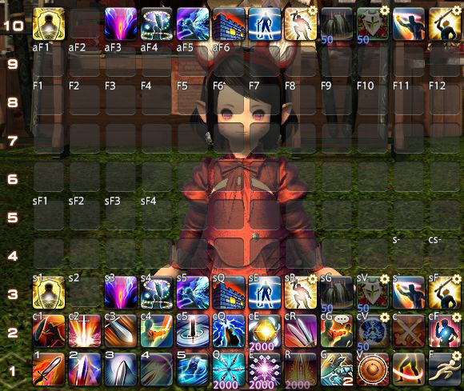

1. 制作一个调试用宏，绑定一个UI存档，把1-10号热键栏整齐的排列，将所有热键栏全部显示，关闭所有热键栏的share，显示热键栏编号，显示未设置的格子。

参考调试宏：
```
/hotbar share 1 off
/hotbar share 2 off
/hotbar share 3 off
/hotbar share 4 off
/hotbar share 5 off
/hotbar share 6 off
/hotbar share 7 off
/hotbar share 8 off
/hotbar share 9 off
/hotbar share 10 off
/hudlayout 3
/hotbar display 4 on
/hotbar display 6 on
/hotbar display 8 on
/hotbar display 10 on
```
显示热键栏编号，显示未设置的格子没有文本指令，只能去角色设置面板里操作。

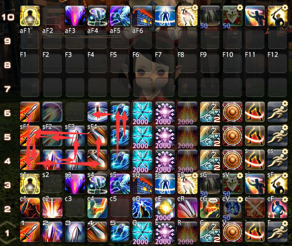

2. 想象链接关系，把想要做宏系统的连击热键在空闲的热键栏上排布成理想的样子并画出连击关系图。  
核心思路：一条热键栏上是一套连击，同时应包含其他连击的起点。各套连击的起点应当尽量保持在同一键位。

- 4号热键栏：正在打沥血连或王权连中，此时不能打赎罪剑否则会中断连击。
- 5号热键栏：打完沥血连或王权连，可以打赎罪剑，因为想再打暴乱剑必定先打先锋剑，所以把暴乱剑替换成赎罪剑。
- 6号热键栏：正在打AOE连，如果之前有没打完的赎罪剑也可以酌情打掉

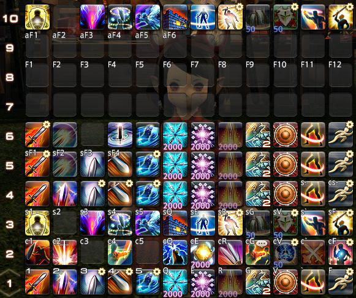

3. 为每个纵向发出箭头的技能做一个宏，宏的内容为`/hotbar copy current 箭头指向的那一栏 current 操作热键栏`。

图中的四个宏分别是：
```
/micon 先锋剑
/ac 先锋剑
/hotbar copy 骑士 4 骑士 1
```
```
/micon 王权剑
/ac 王权剑
/hotbar copy 骑士 5 骑士 1
```
```
/micon 沥血剑
/ac 沥血剑
/hotbar copy 骑士 5 骑士 1
```
```
/micon 全蚀斩
/ac 全蚀斩
/hotbar copy 骑士 6 骑士 1
```


## ASWC一键连击宏
这个思路起源于4.0更新的PVP系统。在远古时代，对战技能和PVE技能组是一样的。在4.0更新时，官方把PVP做了一套专用的技能组，并将各个近战职业的各套连击整合到了一个键位上，跟随连击状态自动切换。

显然官方完全可以做出来，但是就是不想给你做PVE版一键连击。吉田不想做那我们自己做，用宏同样可以做到类似的系统，我们先分析一下这样做要解决哪些问题。

首先是解决切换连击阶段。连击阶段是一个技能状态，它同样是只因打出技能和连击中断而切换。所以我们同样将技能与切换指令绑定。我们在这里直接沿用aswc宏的思路，aswc喊话宏的最后一步`/hotbar copy`是为了将宏恢复原样，如果我们修改一下，让下一个连击状态被复制过来就大功告成了。  

整个过程需要按宏2次：(第一下)按下宏-技能热键覆盖宏-(第二下)按下技能热键-进入队列-1s经过-转到下一个连击状态

以第一栏第4格的精准刺为例：
```
/micon 精准刺
/mlock
/ac 精准刺(补丁，可以删去)
/hotbar set 精准刺 1 4
/wait 1
/hotbar copy 枪术师 5 枪术师 1
```

同样，你需要预设热键栏，建立合理的技能状态热键栏及其相互转换。在上面的例子中，脉冲枪的下一段开膛枪应该做成与之相似的，链接到樱花怒放的宏然后放在与脉冲枪宏同位的第5栏第4格上。其他热键应该保持一致。

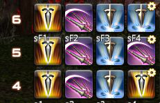

1. 我们来看一下图解：  

2. 我点击精准刺宏，因为这个时候GCD正在空转，补丁`/ac 精准刺`直接成功发动技能，因为GCD已经在空转所以ac不会卡GCD  

3. 1s后，`/hotbar copy 枪术师 5 枪术师 1`生效，贯通刺宏出现在原来的位置  

4. 我点击贯通刺宏，此时GCD还没转好，`/ac 贯通刺`发动技能失败，
`/hotbar set 贯通刺 1 4 贯通刺`热键出现在原来的位置   

5. 我再次点击，贯通刺热键使贯通刺进入技能队列  

6. 可以看到，贯通刺成功通过技能队列释放  

7. 1s后，`/hotbar copy 枪术师 6 枪术师 1 `生效，直刺宏出现在原来的的位置  


连贯起来看一遍：


这种方案中连击的每一个技能都要做宏，很浪费宏位，并且有一些比较麻烦的问题。aswc一键连击虽然很方便，**但容错率很低，需要做大量的弥补失误准备。**

你必须控制按键连打的速度，不要在CD转好1s前就开始激情连打，或是激情连打超过1s以上，否则可能会发生技能未成功释放就已转到下一段的问题。一个折中解决方案是在宏的最后加上wait1(用于延长宏锁)，这可以减少你太过提前按键的机会，但仍然不能完全解决问题。

如果不幸的事故发生了，在技能打出前连击状态就切换了，你还需要一个回退宏或者其他备用热键让你重新能够打出刚才的技能，如果反应够快还可以避免损失。

为了节约回退宏的个数，我们可以利用反存，固定回退到中转栏，而每次按宏时将当前栏反存到中转栏。例如：
```
/micon 精准刺
/mlock
/ac 精准刺
/hotbar copy 枪术师 1 枪术师 7
/hotbar set 精准刺 1 4
/wait 1
/hotbar copy 枪术师 5 枪术师 1
```
```
/e 复位宏
/hotbar copy 枪术士 7 枪术师 1
```

因为这些原因，**我们不推荐操作不熟练、按键喜欢激情乱按的玩家使用aswc一键连击，这个宏系统更适合操作精确的节奏大师玩家。**

aswc一键连击是容错率很低的宏，你必须防止误点、漏点、多点，在GCD还有半秒左右转好的时候高速点击2次。一般来说，我们认为，远距离瞬发技能是最不容易发生事故的。因为读条技能可能会中途断条，近战技能可能会因为射程差一点点摸不到怪。即使这样，你仍然可能遭遇Boss突然飞天遁地导致技能释放失败的情况，**需要熟练掌握复位方法。**

最后考虑如果打出一段中间连击后长时间的转阶段导致的连击中断问题。在最后加上`/wait 15`后跳转回无连击状态看起来是个不错的办法，但是我不建议加，因为这个宏的wait1一旦被打断系统就会崩溃，所以我们要加宏锁，而这个设计需要允许宏被打断，这两个需要是冲突的。还有一些debuff爆炸算玩家使用技能会打断连击的奇怪机制（比如：O4s叉形闪电），需要复位调整回无连击状态，这又要一个复位到无连击的宏。一来一去，就把节约的键位都亏回去了。

## 一字排开

有一些职业爆发阶段技能繁多但是顺序基本固定，而我们在需要一边处理复杂机制一边爆发时很容易手忙脚乱。有些玩家会选择拉出一栏，从左往右依次摆技能，爆发用鼠标从左往右点。

  

如果能移到键盘上，并且只有爆发时显示，不爆发即隐藏是不是更好一些？因此，我们可以使用这种一字排开宏来简化操作。

最典型的例子是忍者。忍者有相当多的技能需要打在自己的背刺爆发中，其中还包含若干忍术。一旦手忙脚乱起来，搓出个兔子就全完了。  

以召唤起手爆发作为示例：

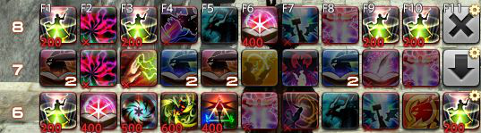

6号热键栏是我备份的1号热键栏，用于打完后恢复。7-8号热键栏上是召唤的起手爆发技能顺序。

- 6号热键栏第11格的宏是启动起手爆发宏，它的功能是预读毁3并将起手爆发第一排复制到1号热键栏：
  ```
  /micon 毁荡
  /ac 毁荡
  /hotbar copy SMN 7 SMN 1
  ```
- 7号热键栏第11格的宏是将下一排的起手爆发第二排复制到1号热键栏：
  ```
  /hotbar copy SMN 8 SMN 1
  ```
- 8号热键栏第11格的宏是打完起手爆发，把热键栏还原成正常状态：
  ```
  /hotbar copy SMN 6 SMN 1
  ```

我们来看一下演示：


是不是看起来非常无脑滚键盘？这样的一字排开宏能优化爆发的体验，只需要按一下启动，然后就可以从左往右滚键盘了。

这个宏虽然可以把复杂的钢琴爆发变成从左到右按技能，但也存在一些缺陷。
假如在之前的战斗中发生了一些意外，某些爆发技能因为boss的机制推迟了，本来固定的爆发安排就会改变。
这种问题你无法设计进去，所以你最好还是把手动弹钢琴也好好练一练，或者将可以移动位置的技能放到一字排开范围外。其中还有些其他问题请自行摸索。

考虑更复杂的情况。爆发阶段根据不同的情况有几种循环的职业，如果采取何种循环可以在爆发开始前预知，可以设置若干个宏来应对不同的情况。

以枪刃为例，枪刃根据本轮爆发是否有血壤，爆发的循环有一点小变化，我们可以做两个启动爆发滚键盘的宏，根据血壤是否转好来选择按哪个。

当然分支更多的职业直接这样设计的话需要消耗很多宏位了。用滚动宏的方法可以大幅减小这个消耗，具体的方法我会在后面介绍。

注：巧用第二键位，可以在已经更变了默认热键的情况下继续1234567890-=滚键盘。

## 菜单宏

### 跳转菜单宏

拨打10086，你会听到：查询流量套餐请按1，办理套餐请按2，办理国际漫游业务请按3，转人工服务请按*，返回上一级菜单请按#...（以上内容纯属虚构）

这是一个跳转菜单，通过对功能分类，用户可以更快找到需要的功能，并节约有限的按键数。利用这种思路来做菜单宏习惯上称为跳转菜单宏。

生产职业技能众多，且包含大量同类技能。许多生产玩家还会使用大量的宏来进行批量制作，键位有时不是很够用。

通过跳转菜单宏可以大幅减少键位。我们参考以上菜单的逻辑，推进展请按1，推品质请按2，恢复耐久请按3，加buff请按4，起手技能请按5，收尾技能请按R，返回菜单请按F...

每一个分类我们用一个宏和一条热键栏来制作(主菜单也算一个分类)，我们在主菜单上放置跳转到各子菜单的宏，这个宏应该是`/hotbar copy`。

生产职业技能8职业间通用，菜单宏用copy制作可以在一个职业制作后通过current全职业共用。

例如，我将裁衣匠4-10分别作为主菜单、作业、加工、耐久、buff、起手、收尾分类热键栏，那么使用`/hotbar copy 裁衣匠 X current 1`就可以在其他生产职业下复制生产菜单。


这张图中，4号热键栏上的是推进度用的技能，5号热键栏上是推品质用的技能，6号热键栏上是上强化buff的技能，7号热键栏上是耐久续航的技能，8号热键栏上是起手用的技能，9号热键栏是收尾用的技能，10号热键栏是主菜单。

我们先在各行热键栏上放置需要的子菜单，再制作一些宏分别链接到这些子菜单就可以了。

我相信我不需要再赘述这些宏的具体内容了，如果你不理解，请回去看翻页宏制作思路图解。我只举出一个稍微有一点变化的宏，第12格上的那个返回主菜单宏。
```
/hotbar copy 裁衣匠 10 current 1
/hotbar copy 裁衣匠 2 current 2
/hotbar copy 裁衣匠 3 current 3
```
第一句是执行返回主菜单，第二、三句是将裁衣匠2、3复制到当前职业的第2、3排，实现将我在裁衣匠职业下调整的键位同步到其他生产职业。

(2号热键栏上是一些触发的监控，3号热键栏上是当前版本常用生产宏)

这样我在一个职业下设置的键位就可以给全生产职业通用了。当然，这样做的缺点是，我只有切换到裁衣匠调整键位才有效。

我们来看一个最终效果：


看起来是不是很方便？虽然生产职业确实更多时候是在直接用15行流程宏在制作，但是高难度配方还是得自己动手，拥有这样一套简洁明了的跳转菜单宏对技能进行分类能够有效提高你上手的速度。

如果一个跳转菜单中除了返回上一级菜单没有任何不能被set系指令放置的东西，并且这个菜单没有下属的二级菜单，有一个比`/hotbar copy`更简单的方案。

我们可以通过`/hotbar set`，将除了返回以外的各格依次set覆盖过去，这样做可以节约一条热键栏，并且调整更加方便：预存的热键栏需要反存或转到对应职业去修改，而使用`/hotbar set`只需要去宏面板修改。
例如：
```
/micon 随机宠物
/hotbar minion 邮差莫古力娃娃 4 1
/hotbar minion 蓝闪蝶 4 2
/hotbar minion 幼碧企鹅 4 3
/hotbar minion 萌神乐团 4 4
/hotbar minion 食果花鼠 4 5
/hotbar minion 小树袋熊 4 6
/hotbar minion 南方度假獭獭 4 8
/hotbar minion 软软垫子 4 9
/hotbar minion 舞海月 4 10
/hotbar minion 旅雀儿 4 11
/hotbar minion 朱孔雀 4 12
```
这个菜单在4号热键栏上，它的第七格是返回键。
我们来看一看实际效果：


看起来是不是有一种动态的效果？这样不但好看而且方便，如果我新获得了一个喜欢的宠物，我只需要打开宏面板把它的名字替换到宏里面去就可以了，省得去宠物面板一大堆宠物里寻找。

### 折叠菜单宏
打开最终幻想14官网，鼠标点击上方的导航栏上就能弹出子菜单，同时母菜单不消失。在需要打开子菜单时才显示，其他时候隐藏，可以大幅节约界面空间。利用这种思路来做菜单宏习惯上称为折叠菜单宏。

由于FF14中一名玩家可以游玩所有职业，有很多玩家的热键栏被一大堆换职业热键塞满。我们可以用折叠菜单宏来改善这种情况。

我们需要1个母菜单，一个子菜单显示器和若干子菜单储存器。我们在母菜单上可以利用系统预置宏图标将职业分为5类：坦克 奶 DPS 生产 采集。

然后我们需要将其对应的子菜单储存器预置好，例如我在刻木匠6-10上分别放置了5类职业的切换热键。
利用`/hotbar display`指令，事先隐藏子菜单显示器，当点击母菜单的宏时，将对应的储存栏复制到显示器并将隐藏的显示器显示，这样就实现了折叠的功能。

我们希望在弹出子菜单，选择了职业后，子菜单能够自己消失，所以我们根据子菜单上的热键数估计选出需要热键的最长时间，在wait后隐藏。

但是如果你有一些切职业绑定了宏，那么切职业宏会将子菜单隐藏打断。最好的办法是在所有切职业宏上都绑定隐藏子菜单显示器。

例如：
```
/hotbar copy 刻木匠 7 share 8
/hotbar display 8 on
/wait 5
/hotbar display 8 off
/hotbar remove 8 all
```
这是一个最简单的折叠宏。5个全部做好以后我们来看一看效果：

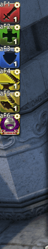

是不是很方便呢？赶快把你乱七八糟的热键栏分类收纳一下吧！

这只是一个最简单的折叠宏，我们可以再在上面加一些有用的东西。

例如，很多工匠都有忘记开收藏品制作buff的经历。~~曾经有一位脚本哥，让全猫区人民喝上了平价魔匠药水HQ~~ **（注：5.3版本之后移除了收藏品制作技能，再也不会有这个问题了）**

我们可以在展开工匠职业的子菜单，延时收起后加一个开收藏buff。

你还可以把各种有意思的东西加入宏中，例如弹出辅助菜单，更换称号，初始化跳转菜单宏……

我举一个超级复杂的例子：
```
/hotbar copy 刻木匠 9 share 8
/hotbar display 5 off
/hotbar display 8 on
/title set 裁衣金针
/hotbar copy 裁衣匠 10 裁衣匠 1
/hotbar copy 裁衣匠 10 锻铁匠 1
/hotbar copy 裁衣匠 10 铸甲匠 1
/hotbar copy 裁衣匠 10 烹调师 1
/hotbar copy 裁衣匠 10 制革匠 1
/hotbar copy 裁衣匠 10 炼金术士 1
/hotbar copy 裁衣匠 10 雕金匠 1
/hotbar copy 裁衣匠 10 刻木匠 1 <wait.3>
/ac 收藏品制作
/hotbar display 8 off
/hotbar remove 8 all
```
和那个最简单的对比一下，这个宏多了几个功能：

- /hotbar display 5 off(关闭我的战斗职业专用辅助菜单)
- /title set 裁衣金针 (切换一个适合生产职业的称号)
- /hotbar copy 裁衣匠 10 XXX 1 (初始化跳转菜单宏，让我最近修改过的键位立刻同步)
- /ac 收藏品制作 (开收藏品buff，妈妈再也不用担心我搓出HQ魔匠药水了)

是不是看起来非常高科技？

刚才我顺便说了一嘴我的战斗职业专用辅助菜单，这个菜单也是一个类似折叠菜单的东西，折叠开关在我的职业切换宏上。

我也解读一下这个宏的作用，想要把切职业宏嵌套在这样的折叠菜单宏里，需要经过一点小小的处理：
```
/micon 学者 classjob
/hotbar display 8 off (关闭子菜单显示器，因为运行这个宏会打断3s后自动关闭子菜单显示器的指令)
/hotbar copy 学者 5 share 5 (将我储存在隐藏区域的辅助菜单复制出来)
/hotbar display 5 on
/gs change 创造现实的魔纹 (切换职业，5.1更新后，可以用套装的名字替代套装序号，这样即使更改了套装顺序也不会切错)
/hotbar remove 8 all (清除子菜单显示器上的内容，因为我的子菜单显示器上有键位，即使已经隐藏了也仍然可能误按)
/title set 博学 (设置一个适合学者身份的称号)
/e 战术乃创造理想现实的途径。(一句职业任务中喜欢的座右铭)
```
是不是感觉到菜单宏的无限可能？我只讲述了菜单宏在非战斗中的应用，但是战斗中也一样可以使用！例如用跳转菜单宏来进行滚键盘爆发，用折叠菜单宏监控技能冷却......

## 中篇小结
当你认真读到这里，相信你已经掌握了绝大多数的有普遍实用意义的宏系统的写法和基本思路，包括：
- aswc式喊话宏
- 翻页宏
- aswc一键连击宏
- 一字排开
- 菜单宏

只要熟练掌握了`/hotbar set`和`/hotbar copy`两个进阶指令的应用，我相信你也可以在十几分钟内信手拈来写出一套完整有效的宏系统。


# 下篇 宏拾遗
## 前言
剩下的下篇，是一些当你深入宏学一段时间后才会遇到的一些问题，例如200个宏位真的写满了什么的，和一些看起来没有什么用的，仔细想想可能有大用也可能完全没有用的玩具。

如果宏学是如此吸引你，想用宏学的方法在艾欧泽亚，至少在你身边的队友中开辟一个新的时代，那么就继续往下看吧。

我相信对于这样的你，我已经不需要再配一些详细的写法和图例了。

### 示例：
- [进阶向]切换战斗、生活和宏设置模式。
  ```
  /hotbar share 1 off
  /hotbar share 2 off
  /hotbar share 3 off
  /hotbar share 4 off
  /hotbar share 5 off
  /hotbar share 6 off
  /hotbar share 7 off
  /hotbar share 8 off
  /hotbar share 9 off
  /hotbar share 10 off
  /hudlayout 3
  /hotbar display 4 on
  /hotbar display 6 on
  /hotbar display 8 on
  /hotbar display 10 on
  /e 切换到宏设置模式
  ```
- [进阶向]在强化翻页宏中使用，进行2种状态的切换。[宏魔法师DLC(内容已过期但思路可用)](https://bbs.nga.cn/read.php?tid=13813382)
- [进阶向]切换战斗、生活与宏设置模式。
  ```
  /hotbar share 1 off
  /hotbar share 2 off
  /hotbar share 3 off
  /hotbar share 4 on
  /hotbar share 5 on
  /hotbar share 6 on
  /hotbar share 7 on
  /hotbar share 8 on
  /hotbar share 9 on
  /hotbar share 10 on
  /hudlayout 1
  /hotbar display 4 on
  /hotbar display 6 off
  /hotbar display 8 off
  /e 切换到战斗模式
  ```
- [进阶向]折叠菜单宏(后文详述)
- 快速将一堆只在少数场合使用的固定的热键放置到指定的位置。
  ```
  /hotbar set 灵攻 7 1
  /hotbar set 三重灾祸 7 2
  /hotbar set 能量吸收 7 3
  /hotbar set 灵攻II 7 4
  /hotbar set 灵攻 7 5
  /hotbar set 龙神附体 7 6
  /hotbar set 灵攻II 7 7
  /hotbar item 2级智力之幻药[HQ] 7 8
  /hotbar set 毁荡 7 9
  /hotbar set 三重灾祸 7 10
  /hotbar set 溃烂爆发 7 11
  /hotbar set 毁荡 7 12
  /e 召唤绝亚起手放置完毕
  ```
- [进阶向]将一个行使完功能的技能宏覆盖为真正的技能热键，使得它能够进入技能队列。（后文详述）
  ```
  /micon 行吟
  /ac 行吟
  /hotbar set 行吟 1 10
  /s 山峦起伏，伴我形骸放浪；
  /em ：万世箴言，予我生息容量；
  /y 正直圣盾，护我无罪羔羊！
  /wait 1
  /hotbar copy 弓箭手 7 吟游诗人 1
  ```
- 将部分用过的热键/不适合用的热键删除，以免失误/重复按到。
  ```
  /cl
  /e -​-​-​-​-​-​-​-​-​-​-​-​-​-​-​-​-​-​-​-​-​-​-​-​-​-​-​-​-​-​-​-​-​-​-​-​-​-​-​-​-​-​-​-​-​-​-​-​-​-​-​-​-​-​-​-​-​-​-​<se.2>
  /e 混沌的连续剑：直线-月环-八方
  /e 复仇的连续剑：月环-八方-直线
  /e -​-​-​-​-​-​-​-​-​-​-​-​-​-​-​-​-​-​-​-​-​-​-​-​-​-​-​-​-​-​-​-​-​-​-​-​-​-​-​-​-​-​-​-​-​-​-​-​-​-​-​-​-​-​-​-​-​-​-​<se.2>
  /hotbar remove 4 4
  ```
- 清空键位重新设置~~删库跑路~~
  ```
  /hotbar remove 1 all
  /hotbar remove 2 all
  /hotbar remove 3 all
  /hotbar remove 4 all
  /hotbar remove 5 all
  /hotbar remove 6 all
  /hotbar remove 7 all
  /hotbar remove 8 all
  /hotbar remove 9 all
  /hotbar remove 10 all
  ```
- [进阶向]翻页宏(后文详述)
- 将当前热键栏设置储存到其他地方备份。
  ```
  /micon 军神的赞美歌
  /hotbar copy 吟游诗人 1 弓箭手 4
  /hotbar copy 吟游诗人 2 弓箭手 5
  /hotbar copy 吟游诗人 3 弓箭手 6
  /e 战斗键位备份完毕
  ```
- [进阶向]在指定位置摆放宏。
- [进阶向]菜单宏(后文详述)
- [进阶向]在强化翻页宏中使用，替代change实现更多功能(后文详述)


## 其他推荐

### 文本指令类：
- `/?` 文本指令主命令：查询官方对该文本指令的解释 请不要再来问这个命令是什么意思了！ 。
- `/gs change 套装编号/套装名 投影模板编号`：更换套装和投影模板。投影模板编号可省略。
- `/hudlayout 界面设置编号`：改变界面UI设置至保存的一套，编号省略则打开设置面板。
- `/ta 目标名`：选中目标，必须使用代名词
- `/mk 标记名 目标名`：对目标打上标记，战场常用指令。
- `/waymark 标记名 目标名`：对目标所在位置标出地面标记，战场常用指令。
- `/facetarget`：面向目标
- `/automove on/off`：开关自动行走，省略on/off则在开关间切换。
- `/nt`：右侧选中最近敌人(相当于tab)
- `/tenemy`: 选中视野内最近的敌人，战场常用指令
- `/tlt`：选中上次选定的目标。
- `/tle`：选中上次选定的敌人，如当前选中的目标是敌人则不切换目标。
- `/busy on/off`：开关忙碌模式，省略on/off则在开关间切换。
- `/battleeffect 目标(self/party/other) 类型`：改变特效演出程度 快速关闭他人特效防止显卡爆炸 ，省略类型则在全开和关之间切换。
- `/playtime`：显示自己累积在线时间。
- `/title set 称号名`：快捷改称号，可以与切职业宏绑定。
- `/shutdown`：关闭游戏
- `ridepillon`: ?

### 整宏类：
- 可以替代tab的功能，方便拉拉肥转火小怪/奶人以后重新选中比较高大的敌人。但是会打断其他宏。
  ```
  /merror off
  /nt
  /ta <le>
  /micon 从左至右切换敌人
  ```
- 一键收起你的召唤物，宠物，陆行鸟并关闭所有其他人的特效，防止世界fate和狩猎车显卡爆炸。
  ```
  /micon 士气高扬之策
  /merror
  /pac 回收
  /cac 离开
  /minion
  /battleeffect party
  /battleeffect other
  ```
- 整合上马和冲刺，可以上马的地方上马，不能上马的地方开冲刺。如果想在可以上马的地方开冲刺，需要跳起来按。
  ```
  /micon 冲刺
  /mount 猪大仙(请自己改喜欢的坐骑)
  /ac 冲刺
  ```
- 五彩斑斓鲜艳夺目的近距离求组宏，提高被组的概率~~和被拉黑的概率~~
  ```
  /sh 111111111111111
  /y 111111111111111
  /s 111111111111111
  /em ：111111111111111
  /e 111111111111111
  ```
  - 蛮族任务常见喊话一键解决
  ```
  /s 超级小可爱线轴看见乌姆·阿拉展开不屈之翼乘风而起，展翅高飞，翱翔天际，高呼：有库啵果哦，大鲶鱼保佑！
  ```
- 战场集火宏，快速选中常见集火标记，如果有多个可能会混乱
  ```
  /merror off
  /选中最近敌人
  /ta <attack>
  /ta <bind>
  /ta <三角>
  ```
- [进阶向]在生产宏中打时间差，实现5仓促中任换至多一个为集中加工一类的高级功能
  ```
  /ac 集中加工 <wait.1>
  /ac 仓促 <wait.2>
  /ac 仓促 <wait.1>
  /ac 集中加工 <wait.1>
  /ac 仓促 <wait.2>
  /ac 仓促 <wait.1>
  /ac 集中加工 <wait.1>
  /ac 仓促 <wait.2>
  /ac 仓促 <wait.1>
  /ac 集中加工 <wait.1>
  /ac 仓促 <wait.2>
  /ac 仓促 <wait.1>
  /ac 集中加工
  /ac 加工 <wait.3>
  ```
  解析请参考[能工巧匠大型综合攻略2.4.2](https://bbs.nga.cn/read.php?tid=12513963)


## 宏事故分析法

对于宏新手来说，最头疼的问题就是刚写的宏出故障又不知道怎么回事。宏故障的原因多种多样，但始终有迹可循。

这里我们先来解析一下文本指令的构造。一个文本指令以/开头，紧随文本指令的主命令。如果这个主命令没有子命令或可以不加子命令，这就是一个完整的文本指令了。

然后是子命令的结构。子命令与主命令间以空格分隔，对于有多级子命令的文本指令，各级子命令间以空格分隔，并从第一个子命令开始编号。

如果事故不幸发生了，而且不能一眼看出哪里错了，我们一般以这样的顺序分析：删掉宏里的`/merror off`（如果它存在），再执行它一遍，看看对话框是否出现报错。如果有报错，那这事情还比较简单。

- “......”出现问题：该命令不存在。
恭喜你，你打了一个错别主命令，赶快去纠正吧。
- “......”出现问题：X号指定的......不正确。
这个情况比较多，我们分情况讨论。
  + 在/ac里，一般只会出现1号指定的技能名不正确和2号指定的目标名不正确。
  + 1号指定的技能名不正确有可能是这个技能不是当前职业的，还没有学会，或者是没有设置的职能技能。当然，还有可能是你打了错别技能名，这里有一系列经典的错别技能名：
比格尔的祝福 快速制作 简约加工 维修 冰彻 死焰法 弃暗投明 武装戎卫 生杀夺予 强点破甲突 通灵之术·大蛤蟆 光速咏唱 星体爆轰 后跳射击 污浊 转移...
我们强烈建议你把热键拖到宏文本框内，这样可以让技能名自动上屏。或者使用定型文来写宏。
  + 2号指定的目标名不正确，这个要么是你指定的逻辑目标现在不存在，要么就是打错代名词了。

在/hotbar命令里出状况的就非常多了。hotbar的1号子命令肯定是那几个(写错了一眼就能看出来)，从2号开始事情就比较麻烦了。

- share、display和change都只有2号可以出现问题：你输入了不存在的热键栏号。
- remove比上面那三个多一级子命令可以错误：3号指定的技能栏编号不正确。这里要注意一件事情，这里的技能栏编号是指上面说的格号，因为技能栏编号相当容易和热键栏编号搞混，所以我单独定义了一个名词。
- set系(set general pet buddy emote item mount minion marking waymark……)报错主要是因为输入了不正确的技能名或分类名，请对照前面的讲解检查是否指定了衍生技能或错别技能名。热键栏编号和格号不存在的情况不再赘述。
- copy的经典错法就是职业名和热键栏号之间没打空格，或者职业名打错了。

其它指令里子命令报错的不多见。

如果没有报错，但是宏就是没有实现预想的功能，那事情就比较麻烦了。首先，我们要确认发生了什么。这个很难分情况讨论，我只讲述一些很常见的情况。
- `/ac 技能 <逻辑目标>` 没有正确对预想的目标释放：如果是一个单独的`/ac`，检查逻辑目标是否正确。如果是复数个`/ac`组成的整合宏，从上到下依次检查理论上的执行结果。治疗宏的问题大多出在`<tt>`出现位置太靠前，目标的目标是敌人所以奶自己。
- `/hotbar change`后出现非预设的热键栏：指定的热键栏可能改变了share状态。
- `/hotbar copy`后热键栏被清空：预设的热键栏出了错误。检查一下你在预设热键栏时是否解除了share。
- wait后的内容没有执行：可能是前一条指令对应动作的后摇过大，导致wait后仍然无法做出动作，或期间其他宏打断了该宏的执行。建议增加wait时间或增加宏锁后再试。
- 没有wait的宏的内容没有完整的执行：检查宏内是否有空排；增加宏锁再试；适当wait等待部分后摇；增加默语完成提示再试。
- 偶发性流程宏卡宏：改善网络状况。
- 宏图标不正确：检查分类名是否正确，名字是否正确，(如果是物品)物品是否持有，是否是HQ没有加记号。

## 上篇小结

学习了这个部分后，你应该能够:
- 自如的操作用户宏界面
- 理解宏的基本原理
- 理解热键栏的独立与客观存在
- 分辨出比较明显的掉输出宏
- 对一些比较重要的指令拥有比较充分的认识
- 写一些简单的宏，不再需要伸手求宏

到这里宏学的上篇就结束了，如果你认真读到这里，你已经不需要伸手求宏了。上篇的内容，足以让你写出伸手能得到的宏了，而比这更高级的宏，已经是十分个性化，不可能伸手得到的了。这些更高级的宏将在中篇中讲解，并且讲解的思路可能会非常跳跃，当你读不懂时，回到上篇来看一看也许会有一些收获。

由于文本指令实在是太多了，笔者只能挑一些很重要，或是很难理解的文本指令在这篇文章中说明，如果你还有什么不明白的指令，试用一下是最好的学习方法！

